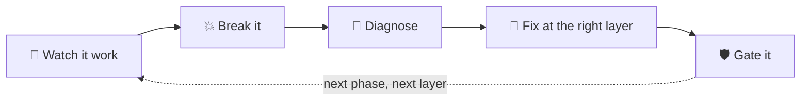
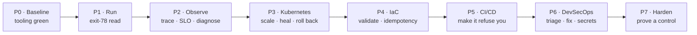

# Capstone Assignment — Operate, Observe, Secure & Harden *daig*

**Audience:** DevOps intern rotation.
**Prereqs:** read [`TRAINING.md`](TRAINING.md); Docker + `make` on your machine.
**Format:** work the phases **in order** — each builds on the last. Capture the
evidence each task asks for in a single `submission/` folder (screenshots,
command output, short notes).
**Worked answers:** [`SOLUTION.md`](SOLUTION.md) — instructor-held. Try every task
before looking.

---

## The goal

> Take daig — a deliberately breakable, three-tier food-delivery platform — from
> "it starts on my laptop" to **"I can run it, prove it works, see inside it,
> break it and recover, ship it safely, and prove it's secure."**

You are the platform engineer on call for the forty minutes before iftar, when a
whole country orders dinner at once. By the end you will have exercised every
layer of a modern delivery stack and, for each, **left a gate behind so the
failure can't silently return.**

The thread through all seven phases is the learning loop — you repeat it at a
different layer each phase:

### The road map — seven phases, in order

Each phase builds on the last; the box under each says what you'll be able to
prove when it's done.

---

## How you'll be assessed

| Dimension | What "good" looks like |
|---|---|
| **Correctness** | The stack runs; the fix actually resolves the symptom |
| **Diagnosis** | You found the cause from *signals* (logs/metrics/traces), not by guessing |
| **Right layer** | You fixed it where it belongs, not where it was easiest |
| **Gating** | Every fix ends with a test / rule / policy / alert that prevents regression |
| **Evidence** | Each task's required artifact is in `submission/`, and is legible |
| **Communication** | You can explain *why*, answer the checkpoint question |

Rubric and per-phase acceptance criteria are at the [end](#acceptance-checklist).

---

## Phase 0 — Environment & baseline (30 min)

**Objective.** Get a clean, verified starting point and prove your tooling works.

**Tasks.**
1. Install the local quality gate: `make hooks`.
2. Run the no-Docker static checks: `make check`. All green before you go further.
3. Read [`VERIFICATION.md`](VERIFICATION.md). In one paragraph, state what is
   *verified* vs *unverified* and why that distinction matters.

**Evidence.** `make check` output; your paragraph → `submission/00-baseline.md`.
**Checkpoint.** Why does `make check` need no Docker or network?

---

## Phase 1 — Run it & the exit-78 exercise (45 min)

**Objective.** Bring the platform up, prove every tier answers, and read a
misconfiguration failure the way the platform intends.

**Tasks.**
1. `make up`, then `make seed`, then `make smoke`. Place a real order end-to-end
   (`./scripts/integration-order.sh`).
2. Build and run the deliberately-broken image: `make broken`, then
   `docker run --rm tkxel/daig-orders:broken`. Read the log and the exit code.
3. Explain, from the log alone, exactly what is misconfigured and how the code
   signalled it.

**Evidence.** `make smoke` output; the broken-run log + `echo $?` →
`submission/01-run.md`.
**Checkpoint.** What is exit code 78, where is it defined in the codebase, and why
is "fail with a named missing variable" better than a stack trace?

---

## Phase 2 — Observability: trace, SLO, diagnose latency (90 min)

**Objective.** See one request cross all three services, define what "healthy"
means, then use the four pillars to diagnose an injected slowdown.

**Tasks.**
1. `make obs`. Open Grafana (http://localhost:3000). Generate traffic with
   `make load`.
2. Find **one trace** that spans web → orders → kitchen → dispatch. Note the total
   duration and which service owns most of it.
3. State daig's availability and latency **SLOs** (from `observability/rules/slo.yml`)
   in your own words, including the monthly error budget in minutes.
4. Inject latency: `./chaos/day4-latency.sh break`. Now **diagnose using the pivot
   chain** — metric (which SLO breaks?) → trace (where is the time?) → logs →
   profile (which function?). Do **not** read the chaos script first.
5. Revert: `./chaos/day4-latency.sh fix`. Confirm the SLO recovers.

**Evidence.** Screenshot of the cross-service trace; your SLO statement; a short
"diagnosis trail" naming the culprit service *and* function →
`submission/02-observability.md`.
**Checkpoint.** Why must a *liveness* probe never query the database, but a
*readiness* probe should? What is a multi-window burn-rate alert protecting you
from that a single "75% budget consumed" threshold does not?

---

## Phase 3 — Reliability on Kubernetes: scale, self-heal, roll back (90 min)

**Objective.** Exercise the four Kubernetes ideas and watch the platform refuse a
bad deploy.

**Tasks.**
1. Render the manifests with **no cluster**: `kubectl kustomize k8s/base` — count
   the objects; confirm images are pinned (no `:latest`).
2. On a local cluster (kind/minikube/Docker Desktop): `kubectl apply -k k8s/base`;
   wait for `orders` to be Ready.
3. **Self-heal:** delete a pod, watch it return.
4. **Scale:** inspect the HPA (`kubectl -n daig get hpa`). Try `kubectl scale
   deploy/orders --replicas=5` and explain what happens within a few seconds.
5. **Roll back:** set a bad image on `orders`
   (`kubectl -n daig set image deploy/orders orders=daig-orders:doesnotexist`),
   observe the rollout **stall**, then `kubectl -n daig rollout undo deploy/orders`.
6. Trigger a crashloop with `./chaos/day3-crashloop.sh break`; diagnose from
   `kubectl describe` / `logs --previous`; revert with `… fix`.

**Evidence.** `kubectl kustomize` object count; description of the stalled
rollout and why old pods kept serving → `submission/03-kubernetes.md`.
**Checkpoint.** Why does declaring both `replicas:` on the Deployment and an HPA
cause "thrash"? Why did the bad rollout *not* cause an outage?

---

## Phase 4 — Infrastructure as Code (75 min)

**Objective.** Treat infrastructure as reviewable code; feel idempotency.

**Tasks.**
1. Terraform (any one cloud, e.g. `infra/aws`): `terraform init -backend=false`,
   `terraform validate`, `terraform fmt -check -recursive`. (No credentials/apply
   required.)
2. In the code, find **three** production-safety controls the audit added and say
   what each prevents: the ECS `lifecycle` block, DB TLS enforcement, and VPC flow
   logs.
3. Explain why the remote-state backend is commented out and what breaks the
   moment two engineers apply against local state.
4. Ansible idempotency: read `ansible/roles/docker/tasks/main.yml`. Explain how
   running the playbook twice yields "changed" then "ok", and identify one task
   that must be idempotent to make that true.

**Evidence.** `validate` output; your three-controls note; your idempotency
explanation → `submission/04-iac.md`.
**Checkpoint.** What does `lifecycle { ignore_changes = [desired_count] }` prevent
during the iftar spike, specifically?

---

## Phase 5 — CI/CD: make the pipeline refuse you (60 min)

**Objective.** Understand a pipeline whose most valuable behaviour is saying no.

**Tasks.**
1. Read `.github/workflows/ci.yml`. List the job dependency graph (what blocks
   what) and identify where images get built vs pushed.
2. Break a unit test in `services/orders/test/health.test.js`; on a branch, show
   the pipeline would fail before `build`/`integration` run. Fix it; show green.
3. Confirm supply-chain hygiene: every `uses:` is pinned to a commit **SHA**, and
   `:latest` is only published from the default branch. Point at the lines.
4. Read `cd.yml`: describe the canary → rollout → rollback flow and the **iftar
   deploy-window guard**.

**Evidence.** The dependency graph; red-then-green test evidence; two pinned-action
line references → `submission/05-cicd.md`.
**Checkpoint.** Why must rollback be one step and not require a rebuild? What does
`concurrency: cancel-in-progress: false` protect on the CD workflow?

---

## Phase 6 — DevSecOps & secrets (120 min)

**Objective.** Run the security gates, triage real findings, fix a planted
vulnerability, and pull credentials from a vault instead of the environment.

**Tasks.**
1. Enable the planted vulnerabilities: `make insecure-on`. Run the local
   toolchain: `make scan-sast` (fast), then `make scan` (full). **Triage** the
   findings — which are real, which are the deliberate teaching vulns?
2. Pick **one** planted vulnerability. Fix it at the right layer. Prove the gate
   now passes for it: re-run the relevant scanner and/or `./chaos/day6-security.sh
   verify`.
3. **Gate it:** add or point to the Semgrep rule / policy that would catch this
   class of bug in future.
4. Secrets: `make vault-up`, then `make vault-app`. Prove the app loaded
   credentials from OpenBao (`"credential_source":"openbao"`), not the environment.
   Read `vault/policies/orders.hcl` and explain how `orders` is prevented from
   reading the payment key.

**Evidence.** Triage table (finding → real/teaching → action); before/after for
your fixed vuln; the `credential_source` log line →
`submission/06-devsecops.md`.
**Checkpoint.** Why are the security gates ordered secrets → SAST → … → DAST? Why
does `secrets.js` **exit 78** rather than fall back to env vars in production?

---

## Phase 7 — Harden & prove it (60 min)

**Objective.** Apply one platform security control end-to-end and demonstrate it
actually constrains behaviour.

**Tasks.**
1. In `k8s/base/networkpolicy.yaml`, identify the default-deny plus the tier
   allows. On a policy-enforcing CNI (Calico/Cilium), demonstrate that `web`
   **cannot** reach `postgres` directly but `orders` **can**.
2. Explain the namespace Pod Security Admission setting (`baseline` enforce,
   `restricted` warn) and what would need to change to enforce `restricted`.
3. Layer the chaos egress block (`k8s/chaos/deny-egress.yaml`) and show the
   observable effect on `orders`; then remove it.

**Evidence.** Proof (command output) of the allowed vs denied path; your PSA
explanation → `submission/07-harden.md`.
**Checkpoint.** Why is a NetworkPolicy only meaningful with a policy-aware CNI, and
how would you *verify* enforcement rather than assume it?

---

## Stretch goals (optional)

- Write the missing sixth Semgrep rule (`daig-direct-pool-query`) and find the one
  place the codebase breaks its own convention.
- Add an HPA-driven autoscaling demo under real load and capture the scale-up on a
  Grafana panel.
- Wire a real Alertmanager receiver (Slack webhook) and make a burn-rate alert
  actually fire.
- Add a unit test for `kitchen` or `dispatch` (the CI matrix is already ready).

---

## Acceptance checklist

You're done when every box is true and the evidence is in `submission/`:

- [ ] **P0** `make check` green; verified-vs-unverified explained
- [ ] **P1** `make smoke` passes; exit-78 log read and explained
- [ ] **P2** one cross-service trace captured; SLOs stated; latency culprit named
      from signals; SLO recovers after revert
- [ ] **P3** `kubectl kustomize` object count; self-heal, HPA behaviour, and a
      *stalled* bad rollout all demonstrated and explained
- [ ] **P4** `terraform validate` green; three safety controls explained;
      idempotency explained
- [ ] **P5** pipeline shown red-then-green; SHA-pinning and `:latest`-gating cited
- [ ] **P6** findings triaged; one vuln fixed **and gated**; app loads secrets from
      OpenBao
- [ ] **P7** allowed-vs-denied network path proven; PSA explained
- [ ] Every checkpoint question answered in your own words

**Do not "make it green" without understanding it.** daig is broken on purpose;
the point is the diagnosis and the gate, not a clean-looking terminal.
