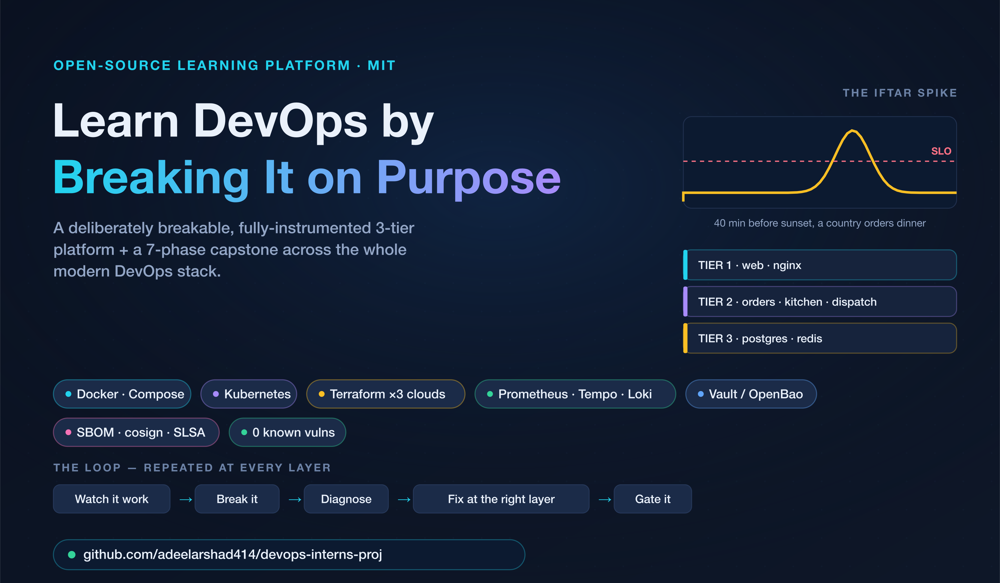
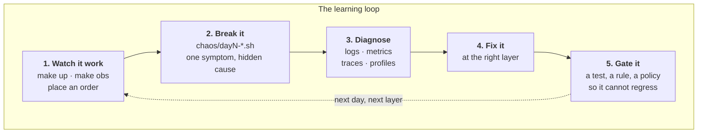
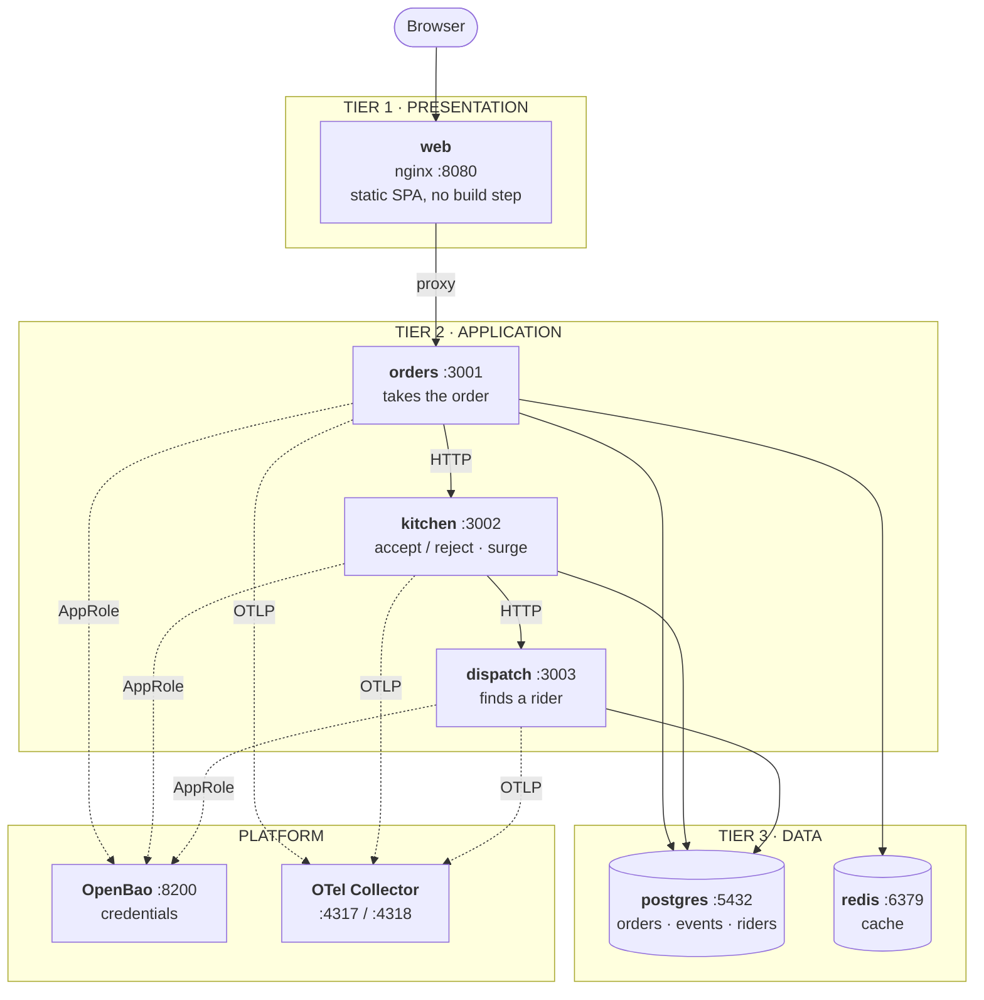
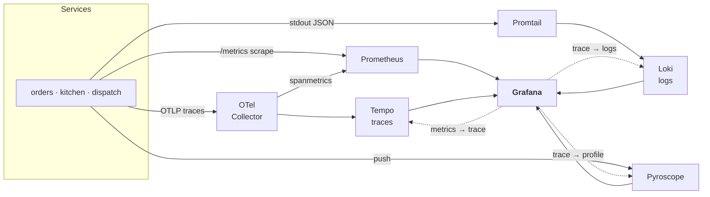
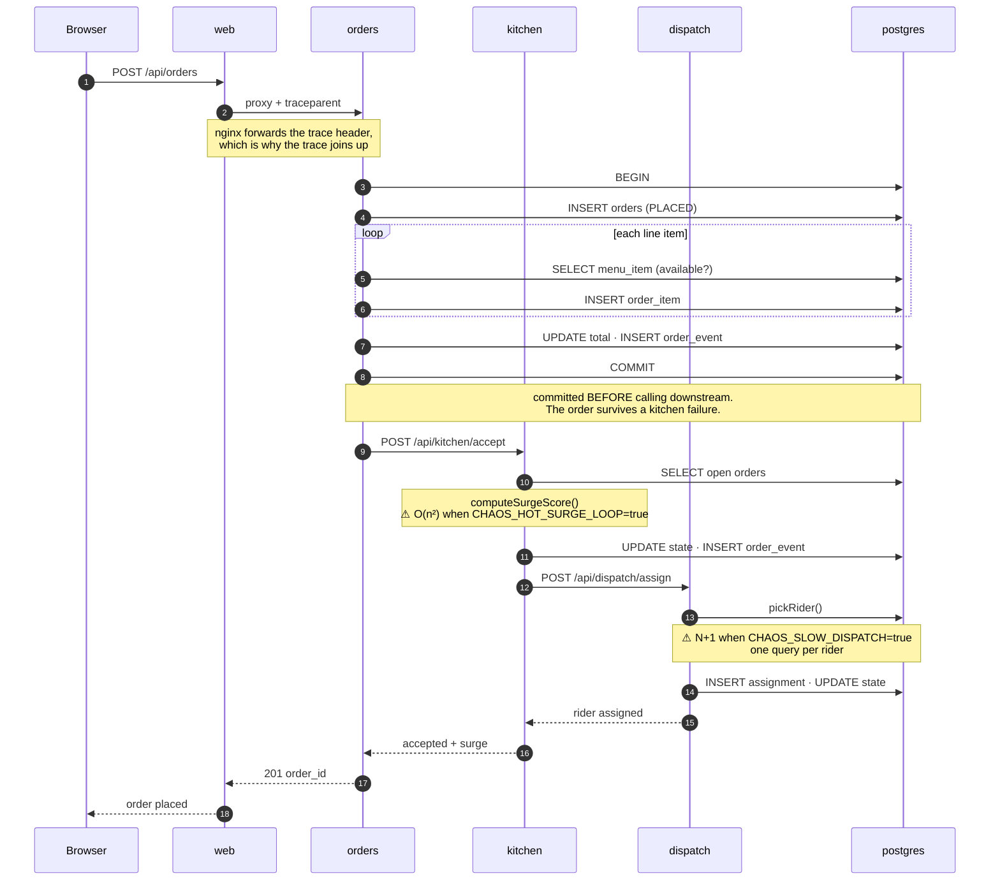
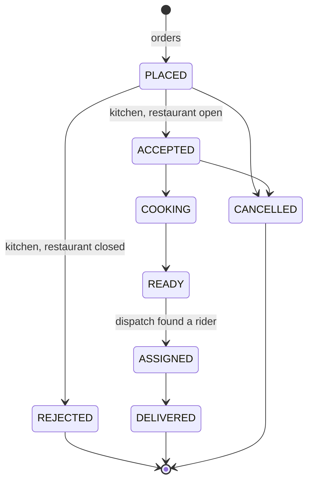
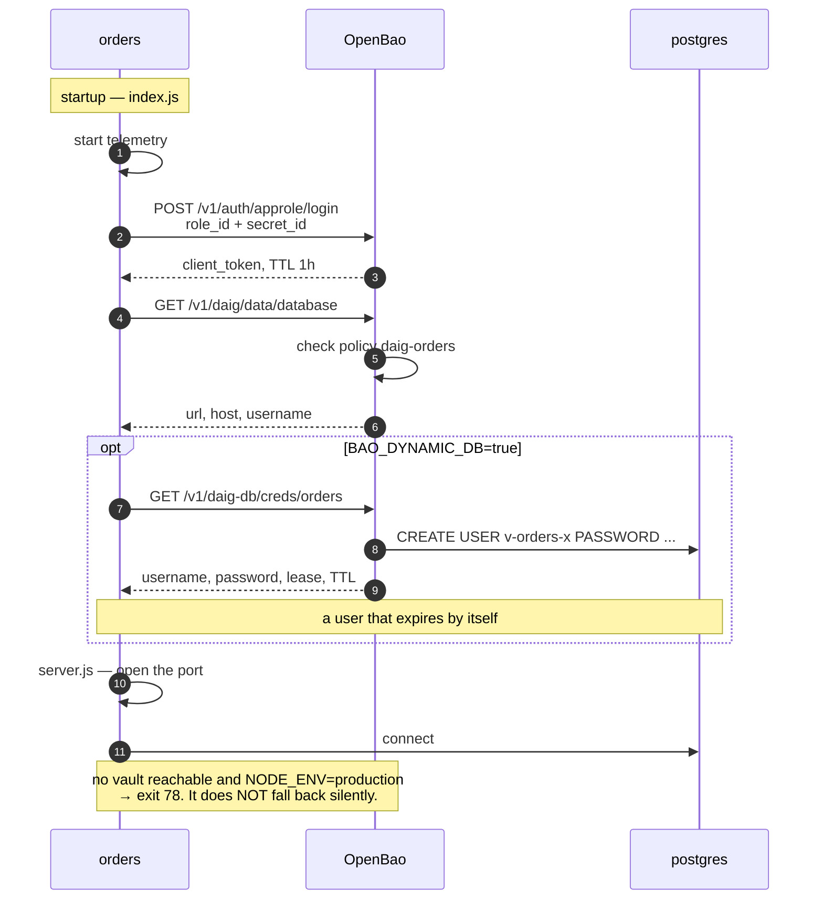
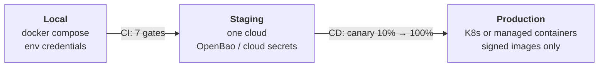
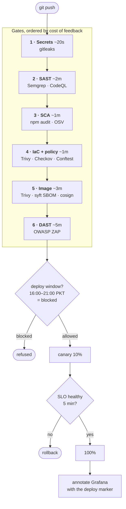

<div align="center">



# Daig

**A deliberately breakable three-tier platform for teaching DevOps.**
*(aka the DevOps Interns Project — Cloud · DevOps · SRE · DevSecOps · Platform Engineering)*

Built as the training substrate for a DevOps intern rotation.

[](https://github.com/adeelarshad414/devops-interns-proj/actions/workflows/ci.yml)
[](LICENSE)
[](.nvmrc)
[](CHANGELOG.md)
[](VERIFICATION.md)

</div>

---

> **The core stack now runs, and CI proves it.** Every push builds all four
> images and stands the full stack up — postgres, redis, orders, kitchen,
> dispatch, web — then places a real order end-to-end (`Integration - full
> stack`, a required merge gate). What is **not** yet executed — a live
> `terraform apply`, the OpenBao end-to-end flow, a real cluster — is tracked
> honestly in [`VERIFICATION.md`](VERIFICATION.md). "I ran it" and "it should
> work" are different claims, and this repo does not blur them — which is itself
> the first thing it teaches.

---

## ⚠️ Reading the CI signal (some red is the point)

This repo is a DevSecOps *teaching target*, so a few checks are **designed to
report findings**:

- **SAST / dependency / IaC-policy jobs** flag the deliberately-planted
  vulnerabilities (`services/orders/src/insecure.js`, the TLS-less ALB, the
  inline k8s Secret…). A scanner going red here means it's **working** — that is
  the lesson (see [`SECURITY.md`](SECURITY.md)).
- **Core CI** (static checks, unit tests, image build) is expected green — that's
  the [](https://github.com/adeelarshad414/devops-interns-proj/actions/workflows/ci.yml)
  badge above and the required merge gate on `main`.
- Application dependencies are at **0 known vulnerabilities**; the security jobs
  fire on the *planted application code*, not on outdated packages.

---

## 📚 Start here — the learning path

1. **[`TRAINING.md`](TRAINING.md)** — one-stop handbook: every area's concepts,
   cheatsheets and guidelines (Linux → Docker → k8s → IaC → CI/CD → DevSecOps →
   Vault → SRE → chaos), each grounded in a real file here.
2. **[`ASSIGNMENT.md`](ASSIGNMENT.md)** — the capstone project: goal, seven
   phased tasks in sequence, required evidence, and an acceptance checklist.
3. **Worked answers** — step-by-step solutions and checkpoint answers.
   **Instructor-held in the private
   [devops-interns-proj-solutions](https://github.com/adeelarshad414/devops-interns-proj-solutions)
   repo** so this public repo stays answer-free. Request access from the maintainer.

> 🎤 **Running a kickoff?** [`docs/daig-intern-bootcamp.pptx`](docs/daig-intern-bootcamp.pptx)
> is the instructor-led deck — 18 slides (foundations + the hands-on track) with
> speaker notes on every slide. [PDF](docs/daig-intern-bootcamp.pdf) for quick viewing.

> 🃏 **Print for every intern:** the one-page [cheat-card](docs/assets/intern-cheat-card.pdf)
> — the loop, the commands, the diagnostic pivot, the 7-phase checklist, and the golden rules.

> 🖼️ **See it in diagrams:** a [domains & concepts coverage map](docs/assets/diagram-A-domains-coverage.png)
> plus flow diagrams for CI/CD, Kubernetes, IaC, observability, Docker and traffic — in
> [`TRAINING.md`](TRAINING.md#-the-whole-system-in-diagrams).

> 🤖 **AIOps POC:** an [AI SRE Incident Copilot](ai/incident-copilot/) reads the live
> observability signals during an incident, proposes ranked root-cause hypotheses, and
> ships an eval harness that grades how often it's right (`make copilot` / `make copilot-eval`).

> 🗺️ **New to the field?** [roadmap.sh/devops](https://roadmap.sh/devops) is the
> canonical *what to learn* map — daig is the *do it* companion. TRAINING.md maps
> each area to its roadmap.sh track ([kubernetes](https://roadmap.sh/kubernetes),
> [terraform](https://roadmap.sh/terraform), [devsecops](https://roadmap.sh/devsecops), …).

---

## Contents

1. [What this is](#what-this-is)
2. [How it works](#how-it-works)
3. [Quick start](#quick-start)
4. [Architecture](#architecture)
5. [Request flow](#request-flow)
6. [Credential flow](#credential-flow)
7. [Deployment](#deployment)
8. [The documentation, and how to use it](#the-documentation-and-how-to-use-it)
9. [Directory structure](#directory-structure)
10. [Requirements](#requirements)
11. [Deliberate defects](#deliberate-defects)
12. [Contributing](#contributing)

---

## What this is

Daig is a food-delivery platform. Customers order, restaurants accept, riders
deliver. Three services, one database, one payment integration.

**It is not good software. It is good *teaching* software.** Every tier is real,
every layer is instrumented, and several things are wrong on purpose so there is
something true to find.

The name: a *daig* is the pot you cook in when you are feeding everybody at once.
That is the entire engineering problem in one word — and it is why the system's
defining failure is the forty minutes before iftar, when an entire country orders
dinner simultaneously against a deadline set by the sun.

### Design principles

| Principle | Consequence |
|---|---|
| Real over simplified | Genuine distributed tracing, genuine secret management, genuine IaC |
| Small enough to hold in your head | Three services. An intern can debug the whole thing on day six. |
| Broken on purpose, labelled in place | Every defect is annotated with what it teaches |
| Evidence over assertion | `VERIFICATION.md` separates "I ran it" from "it should work" |
| Comments explain *why* | The repository is read far more often than it is run |

---

## How it works



Every day of the rotation is one pass around that loop at a different layer —
Linux, then infrastructure, then containers, then pipelines, then security, then
orchestration. **Step 5 is the one that gets skipped and the one that matters**:
a fix without a gate regresses within two sprints.

---

## Quick start

```bash
git clone https://github.com/adeelarshad414/devops-interns-proj && cd devops-interns-proj
cp .env.example .env
cp .githooks/pre-commit .git/hooks/pre-commit && chmod +x .git/hooks/pre-commit

make up          # the three tiers
make seed        # restaurants and menu items
make smoke       # verify every tier answers
make obs         # add observability
make load        # simulate the iftar spike
```

| Service | URL | Credentials |
|---|---|---|
| Daig | http://localhost:8080 | — |
| Grafana | http://localhost:3000 | `admin` / `CHANGE_ME_DEV_ONLY` |
| Prometheus | http://localhost:9090 | — |
| OpenBao | http://localhost:8200 | root token in `vault/.init-keys.json` |
| SonarQube | http://localhost:9000 | `admin` / `admin`, forced change |

### The overlays

Each is a separate compose file so a laptop is not asked to run everything at
once.

```bash
make obs          # observability: Prometheus, Loki, Tempo, Pyroscope, Grafana
make vault-up     # OpenBao: initialise, unseal, provision
make vault-app    # run Daig with credentials from OpenBao
make sonar        # SonarQube (wants ~2GB RAM on its own)
make sec-up       # ZAP, Falco
```

`make down` stops everything. `make nuke` also deletes volumes — including the
database.

---

## Architecture

### Three tiers



**Why the tier boundaries are enforced rather than documented.** The data network
is `internal: true` in Swarm; the AWS security groups only permit 5432 from the
application tier's group; the Kubernetes NetworkPolicy restricts egress. The
three-tier model is not a diagram someone has to remember — it is what the
network will actually allow.

### Observability



The dotted arrows are the point. They are wired in
`observability/grafana/provisioning/datasources/datasources.yaml` so that one
slow request can be followed from *"something is wrong"* to *"this line of code"*
in four clicks:

| Click | Pillar | Question answered |
|---|---|---|
| 1 | Metrics | p95 crossed the 1s SLO — but where? |
| 2 | Traces | `dispatch` owns 8 of 9 seconds, with 40 sequential DB spans |
| 3 | Logs | the exact log lines for that trace id |
| 4 | Profiles | `computeSurgeScore` is 71% of CPU |

**Four pillars exist because four different questions need answering.** Day 4
proves it: one deliberate defect is findable *only* in traces, another *only* in
profiles, and neither in metrics alone.

---

## Request flow

One order, end to end. This sequence is what produces a single trace crossing
three services and two data stores.



### Order state machine



Enforced by a `CHECK` constraint in `db/init/001_schema.sql`. Every transition
appends a row to `order_events` — **nothing is ever overwritten**, so the history
of an order is reconstructable. Temporal rows, additive migrations only.

---

## Credential flow



That last note is the design decision worth defending. A service that quietly
degrades from *"secrets from the vault"* to *"secrets from the environment"* is
how a misconfiguration becomes a credential leak nobody notices for six months.
`services/_shared/secrets.js` refuses.

Full detail, including AppRole rationale and the production delta table:
[`vault/README.md`](vault/README.md).

---

## Deployment

### Environments



### The pipeline



**Why that ordering.** Cheapest and fastest first. A leaked key must never merge
and takes 20 seconds to detect. DAST needs the whole stack running. If a
developer waits twelve minutes to learn about a typo they stop trusting the
pipeline — and *a pipeline people work around protects nobody*.

**The deploy-window guard** in `.github/workflows/cd.yml` physically refuses to
deploy during the iftar peak. That is the platform engineer's answer: do not ask
people to remember, make the wrong thing impossible.

### Targets

| Target | Manifests | Notes |
|---|---|---|
| Local | `docker-compose*.yml` | Five overlays, composable |
| Docker Swarm | `swarm/daig-stack.yml` | Teaching ladder to Kubernetes. In maintenance — see [`docs/SWARM.md`](docs/SWARM.md) |
| Kubernetes | `k8s/base/` | Kustomize. Deploy, scale, self-heal, roll back |
| AWS | `infra/aws/` | ECS Fargate, RDS, ALB, ECR, Secrets Manager |
| GCP | `infra/gcp/` | Cloud Run, Cloud SQL, Artifact Registry, Secret Manager |
| Azure | `infra/azure/` | Container Apps, Flexible Server, ACR, Key Vault |

The three cloud stacks are **deliberately parallel** so Day 2 can make the point
that matters: the concepts are identical and only the nouns change. Apply one
properly, read the other two.

Full procedures: [`docs/DEPLOYMENT.md`](docs/DEPLOYMENT.md).

---

## The documentation, and how to use it

Fifteen markdown files, each with one job. **Read them in this order.**

### Start here

| File | Read it when |
|---|---|
| **README.md** | You are here. Architecture, flows, structure. |
| [`VERIFICATION.md`](VERIFICATION.md) | **Before trusting anything.** What has run vs what has only been written. |
| [`PROGRESS.md`](PROGRESS.md) | Start of every work session. Living source of truth. |
| [`docs/CHARTER.md`](docs/CHARTER.md) | **Objective, questions, milestones, targets, tasks.** The one page to point at. |
| [`docs/COVERAGE.md`](docs/COVERAGE.md) | Planning the rotation. Twenty skills, six days, honest depth per skill. |

### Running the rotation

| File | For |
|---|---|
| [`docs/CHEATSHEET.md`](docs/CHEATSHEET.md) | **Hand out on Day 1.** Commands and the diagnostic ladder, no answers. |
| _Worked solutions_ (private repo) | **Instructor-held** in [devops-interns-proj-solutions](https://github.com/adeelarshad414/devops-interns-proj-solutions) — `SOLUTION.md`, `docs/SOLUTIONS.md`. Step-by-step for every task, chaos variant and checkpoint question. |
| _Instructor notes_ (private repo) | **Answers, pacing, cost control** — `docs/INSTRUCTOR.md` in the private repo. Not for interns. |
| [`docs/DAY1.md`](docs/DAY1.md) → [`DAY5.md`](docs/DAY5.md) | Per-day run sheets: build, chaos hour, deliverable |

### Topic guides

| File | Covers |
|---|---|
| [`docs/GIT.md`](docs/GIT.md) | Git as a diagnostic tool. `bisect`, `blame`, `reflog`. |
| [`docs/DOCKER-NETWORKS-VOLUMES.md`](docs/DOCKER-NETWORKS-VOLUMES.md) | The two Docker subjects that get skipped |
| [`docs/DEVSECOPS.md`](docs/DEVSECOPS.md) | Seven gates, six vulnerabilities, supply chain, secrets |
| [`docs/SWARM.md`](docs/SWARM.md) | Swarm as a ladder to Kubernetes, with a translation table |
| [`docs/SONARQUBE.md`](docs/SONARQUBE.md) | Quality gates, and why coverage is a proxy not a goal |
| [`vault/README.md`](vault/README.md) | OpenBao: AppRole, policies, dynamic credentials, audit |

### Reference

| File | Covers |
|---|---|
| [`docs/ARCHITECTURE.md`](docs/ARCHITECTURE.md) | Design decisions and the tradeoffs behind them |
| [`docs/REQUIREMENTS.md`](docs/REQUIREMENTS.md) | Functional and non-functional requirements, with IDs |
| [`docs/DEPLOYMENT.md`](docs/DEPLOYMENT.md) | Environment-by-environment procedures and rollback |
| [`docs/COST.md`](docs/COST.md) | What the rotation costs on each cloud, computed not asserted |
| [`DUMMY-VALUES.md`](DUMMY-VALUES.md) | Every registered placeholder credential |
| [`CONTRIBUTING.md`](CONTRIBUTING.md) | Conventions, including the rules specific to a teaching repo |
| [`SECURITY.md`](SECURITY.md) | **The deliberate vulnerabilities. Do not report them.** |
| [`CHANGELOG.md`](CHANGELOG.md) | What changed, and what is still unverified |

### The convention these files follow

- **Every claim is falsifiable.** No "should work" presented as "works".
- **`VERIFICATION.md` is the authority** on execution status. Not the README, not
  a commit message.
- **Instructor material is separate** and kept private. Answers live in the
  [devops-interns-proj-solutions](https://github.com/adeelarshad414/devops-interns-proj-solutions)
  repo; nothing in this public repo does.
- **Deliberate defects are labelled at the point of definition**, not only in
  documentation, because that is where someone reading the code will be.

---

## Directory structure

```
daig/
│
├── README.md                     ← you are here
├── VERIFICATION.md               what has actually been executed
├── PROGRESS.md                   living source of truth
├── CHANGELOG.md · CONTRIBUTING.md · SECURITY.md · LICENSE
├── DUMMY-VALUES.md               every registered placeholder credential
├── Makefile                      every workflow, self-documenting (make help)
├── .env.example                  copy to .env
│
├── docker-compose.yml            base: the three tiers
├── docker-compose.obs.yml        overlay: observability
├── docker-compose.vault.yml      overlay: OpenBao
├── docker-compose.sonar.yml      overlay: SonarQube
├── docker-compose.security.yml   overlay: ZAP, Falco
│
├── services/                     ── APPLICATION ──────────────────────
│   ├── _shared/                  cross-service modules
│   │   ├── secrets.js            OpenBao → env → exit 78
│   │   ├── telemetry.js          OpenTelemetry bootstrap
│   │   ├── metrics.js            four Prometheus series that matter
│   │   ├── logger.js             JSON logs with trace_id injected
│   │   ├── db.js                 pool with per-query timing
│   │   └── guard.js              exit-78 config guard
│   ├── web/                      TIER 1 · nginx + SPA, no build step
│   ├── orders/                   TIER 2 · entry point
│   │   ├── src/index.js          bootstrap: telemetry, then credentials
│   │   ├── src/server.js         the application
│   │   ├── src/insecure.js       ⚠ six deliberate vulnerabilities
│   │   ├── test/                 unit tests
│   │   └── Dockerfile            multi-stage, incl. the :broken target
│   ├── kitchen/                  TIER 2 · accept/reject · ⚠ O(n²) surge loop
│   └── dispatch/                 TIER 2 · rider assignment · ⚠ N+1 query
│
├── db/init/                      ── DATA ─────────────────────────────
│   ├── 001_schema.sql            additive only · ⚠ two indexes commented out
│   └── 002_seed_reference.sql    restaurants and riders
│
├── vault/                        ── CREDENTIALS ──────────────────────
│   ├── config/config.hcl         server config, annotated
│   ├── policies/*.hcl            four least-privilege policies
│   ├── agent/                    sidecar alternative to in-app integration
│   ├── bootstrap.sh              init → unseal → provision → verify
│   ├── demo.sh                   guided walkthrough
│   └── README.md
│
├── observability/                ── TELEMETRY ────────────────────────
│   ├── otel-collector.yaml       the seam between code and vendors
│   ├── prometheus.yml · loki.yaml · tempo.yaml · promtail.yaml
│   ├── rules/slo.yml             SLO recording rules + four alerts
│   └── grafana/                  provisioned datasources and dashboard
│
├── security/                     ── DEVSECOPS ────────────────────────
│   ├── semgrep/daig.yml          custom SAST rules (one is an exercise)
│   ├── policy/*.rego             OPA: Dockerfile, Kubernetes, Terraform
│   ├── kyverno/policies.yaml     admission control + image signature
│   ├── zap/rules.tsv             DAST, with triage decisions recorded
│   ├── falco/rules.yaml          runtime detection
│   ├── scan-all.sh               the whole toolchain, locally
│   ├── sign-and-verify.sh        SBOM, provenance, cosign
│   └── vault-demo.sh
│
├── infra/                        ── INFRASTRUCTURE AS CODE ───────────
│   ├── aws/                      ECS Fargate · RDS · ALB · ECR
│   ├── gcp/                      Cloud Run · Cloud SQL · Artifact Registry
│   └── azure/                    Container Apps · Flexible Server · ACR
│
├── ansible/                      ── CONFIG MANAGEMENT ────────────────
│   ├── site.yml · ansible.cfg
│   ├── inventories/dev/
│   └── roles/{common,docker,daig_app,postgres}/
│
├── k8s/                          ── ORCHESTRATION ────────────────────
│   ├── base/                     kustomize: deployments, services, PDBs, HPA
│   └── chaos/                    Demo Day scenario manifests
├── swarm/daig-stack.yml          the ladder to Kubernetes
│
├── chaos/                        ── EXERCISES ────────────────────────
│   ├── day1-network.sh           three planted causes, one symptom
│   ├── day2-drift.sh             Terraform state vs reality
│   ├── day3-crashloop.sh         config missing / wrong / environment wrong
│   ├── day4-latency.sh           the N+1 and the hot loop
│   ├── day5-demoday.sh           nine scenarios, assigned at random
│   └── day6-security.sh          find and fix six vulnerabilities
│
├── load/iftar-spike.js           zero-dependency load generator
├── scripts/                      smoke · seed · integration · init-repo
│   └── cost-model.py             deterministic cost model, all three clouds
├── .githooks/pre-commit          CI checks, locally, in two seconds
│
├── .github/
│   ├── workflows/                ci · cd · security · quality · devsecops
│   ├── ISSUE_TEMPLATE/
│   ├── CODEOWNERS · dependabot.yml · pull_request_template.md
│
└── docs/                         ── DOCUMENTATION ────────────────────
    ├── ARCHITECTURE.md · REQUIREMENTS.md · DEPLOYMENT.md
    ├── CHARTER.md                objective, questions, milestones, targets, tasks
    ├── COVERAGE.md               the scope decision
    ├── COST.md                   what it costs on each cloud
    ├── CHEATSHEET.md             hand out Day 1. commands only.
    │                             (worked answers → private solutions repo)
    ├── DAY1–DAY5.md
    └── GIT.md · DOCKER-NETWORKS-VOLUMES.md · SWARM.md
        · SONARQUBE.md · DEVSECOPS.md
```

**⚠ marks a deliberate defect.**

---

## Requirements

Summarised. Full list with acceptance criteria and IDs:
[`docs/REQUIREMENTS.md`](docs/REQUIREMENTS.md).

### Functional

| ID | Requirement |
|---|---|
| FR-1 | A customer can list restaurants and their available menu items |
| FR-2 | A customer can place an order with one or more line items |
| FR-3 | The kitchen accepts or rejects based on whether the restaurant is open |
| FR-4 | Dispatch assigns the least-loaded on-shift rider in the customer's area |
| FR-5 | Every state transition appends an immutable `order_events` row |
| FR-6 | Order totals are computed in integer paisa — never floating point |
| FR-7 | An order survives downstream failure; it is committed before the call |
| FR-8 | Every service exposes `/healthz`, `/readyz` and `/metrics` |
| FR-9 | One customer request produces one trace spanning all three services |
| FR-10 | Credentials resolve from OpenBao, or fail closed |

### Non-functional

| ID | Requirement | Target |
|---|---|---|
| NFR-1 | Availability SLO | 99.9% of order requests, 30-day window (43 min/month) |
| NFR-2 | Latency SLO | p95 of `POST /api/orders` under 1s |
| NFR-3 | Iftar spike | Survive 100× baseline for 20 minutes with load shedding, not collapse |
| NFR-4 | Startup | Ready within 30s of container start |
| NFR-5 | Observability | Every request emits a log, a metric and a span, all correlatable |
| NFR-6 | Secrets | No credential in code, image, or environment in production |
| NFR-7 | Containers | Non-root, read-only root filesystem, all capabilities dropped |
| NFR-8 | Supply chain | Every image signed; SBOM attached; unsigned images refused admission |
| NFR-9 | Schema | Additive only. No destructive migration, ever. |
| NFR-10 | Rollback | One step, no rebuild, under 2 minutes |
| NFR-11 | Cost | All monthly figures derive from **730 hours/month**, consistently |
| NFR-12 | Teachability | An intern can hold the whole architecture in their head by day six |

NFR-12 is a real constraint, not a slogan. It is why there are three services
rather than twelve, and why the frontend has no build step.

---

## Deliberate defects

Nothing here is an accident.

| Where | Defect | Teaches | Day |
|---|---|---|---|
| `orders` image `:broken` target | Exits 78, no `DATABASE_URL` | Read the logs before guessing | Kickoff |
| `chaos/day1-network.sh` | DNS, packet drop, or wrong port | Hang vs refuse; layer isolation | 1 |
| `chaos/day2-drift.sh` | State and reality disagree | `apply` vs `import` vs `state rm` | 2 |
| `chaos/day3-crashloop.sh` | Config missing / wrong / env wrong | Exit codes discriminate | 3 |
| `dispatch` `pickRider()` | N+1 query | Findable **only** in traces | 4 |
| `kitchen` `computeSurgeScore()` | O(n²) loop | Findable **only** in profiles | 4 |
| `db/init/001_schema.sql` | Two indexes commented out | Measure before and after | 4 |
| `docker-compose.yml` | Database port published to host | Which ports would you remove? | 3 |
| `services/orders/src/insecure.js` | **Six CWE-tagged vulnerabilities** | Five are found by tools. One is not. | 5 |
| `infra/aws/loadbalancer.tf` | No TLS on the ALB | tfsec is right to flag it | 5 |
| `k8s/base/secret.yaml` | Inline `stringData` | What production does instead | 5 |
| `chaos/day5-demoday.sh` | Nine scenarios | Diagnosis under pressure | 6 |

**The most important one is the vulnerability tools cannot find.** The IDOR in
`insecure.js` has parameterised SQL, no unsafe call, and nothing any scanner can
point at. What is *missing* is a business rule. That is why code review exists,
and it is the single most valuable thing in this repository.

**Instructors:** the private
[devops-interns-proj-solutions](https://github.com/adeelarshad414/devops-interns-proj-solutions)
repo has every answer (`docs/INSTRUCTOR.md`). Request access; interns don't get it.

---

## Contributing

See [`CONTRIBUTING.md`](CONTRIBUTING.md). Three rules that are unusual and
matter here:

1. **Do not fix the deliberate defects.** A PR that fixes the N+1 removes Day 4.
2. **Do not claim verification that did not happen.** Every PR asks what you ran.
3. **Never a real credential.** Placeholders are `CHANGE_ME_DEV_ONLY`, registered
   in `DUMMY-VALUES.md`, and CI fails the build if one escapes.

### Pushing this somewhere

```bash
./scripts/init-repo.sh git@github.com:<you>/daig.git
git push -u origin main
```

The script refuses to initialise if it finds `.env`, `vault/.init-keys.json`, or
anything shaped like a real credential — because the first commit is the one
people are least careful about, and Git history is forever.

Then, on the forge: protect `main`, require CI and a CODEOWNERS review, enable
secret scanning with push protection, add `SONAR_TOKEN` and `SONAR_HOST_URL`, and
replace the placeholder handles in `.github/CODEOWNERS`.

---

<div align="center">

**MIT licensed.** Built for the tkxel DevOps intern rotation, 2026.

*Not production software. Never deploy it.*

</div>
