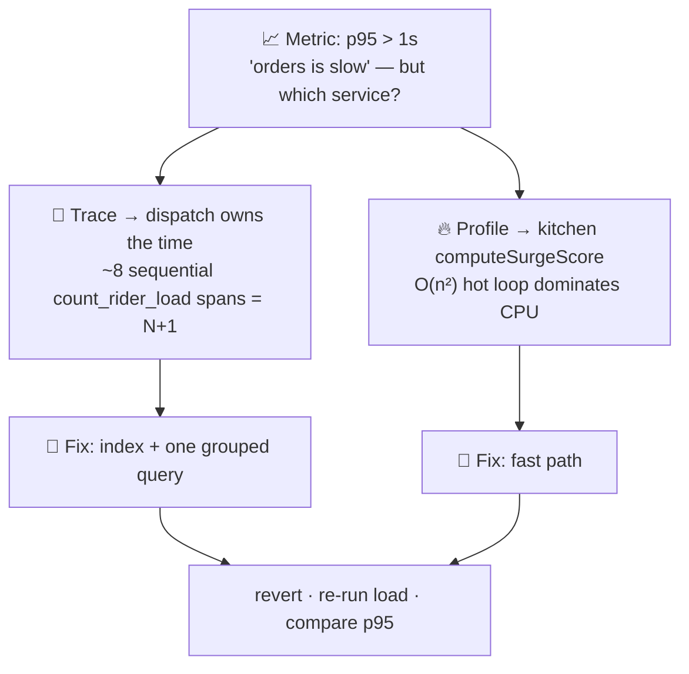
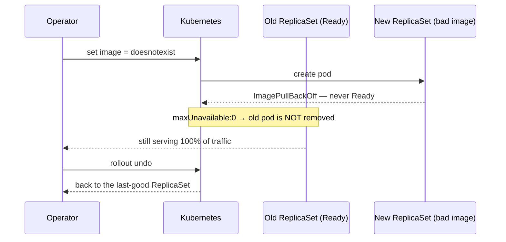
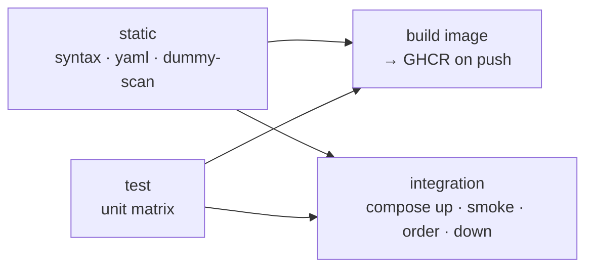
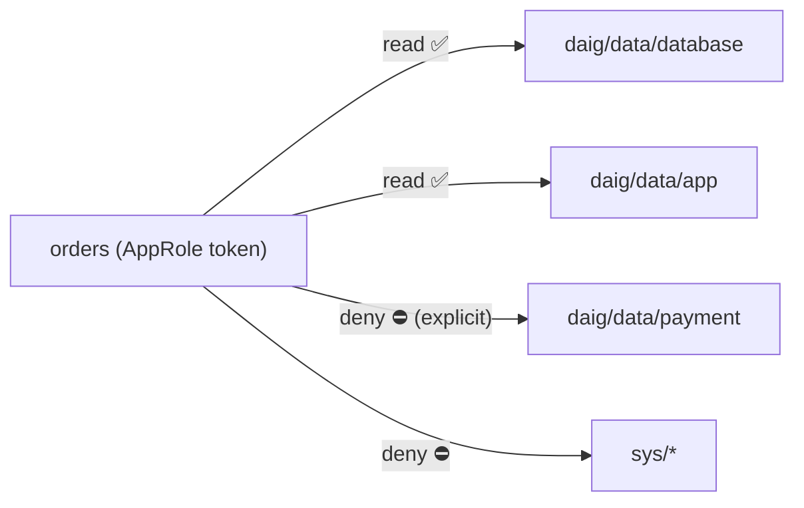

# Solution Guide — Capstone Assignment (INSTRUCTOR-HELD)

> **Do not hand this to interns.** Worked answers, expected output, and model
> answers to every checkpoint question in [`ASSIGNMENT.md`](ASSIGNMENT.md).
> Deeper per-vulnerability answers live in [`docs/INSTRUCTOR.md`](docs/INSTRUCTOR.md)
> and [`docs/SOLUTIONS.md`](docs/SOLUTIONS.md).

Conventions: `$` = a command to run; **Expected** = what a correct run shows.
Everything here is executable against the repo as shipped.

---

## Phase 0 — Environment & baseline

```bash
$ make hooks      # copies .githooks/pre-commit → .git/hooks/pre-commit
$ make check      # js (node --check) + shell (bash -n) + yaml + json
```
**Expected.** `all static checks passed`. No Docker daemon or network is touched —
that's the whole point: `node --check`, `bash -n`, and `yaml/json` parsing are
pure syntax checks, so a laptop with no Docker can still gate a commit in seconds.

**Verified vs unverified (model answer).** VERIFICATION.md splits *"I ran it"* from
*"it should work"*: syntax-checked/kustomize-rendered/compose-config-validated
(static) vs actually executed end-to-end (mostly not). It matters because a repo
that blurs the two teaches false confidence — the first lesson of the rotation.

**Checkpoint.** `make check` runs only parsers/linters (`node --check`, `bash -n`,
PyYAML, `json.load`) — none of which execute code or open sockets.

---

## Phase 1 — Run it & exit-78

```bash
$ make up && make seed && make smoke
$ ./scripts/integration-order.sh
$ make broken
$ docker run --rm tkxel/daig-orders:broken ; echo "exit=$?"
```
**Expected.** `smoke` reports every tier answering; the integration script walks an
order orders→kitchen→dispatch. The broken container logs a single fatal JSON line
naming the missing variable and exits **78**:
```json
{"level":"fatal","msg":"Missing required configuration: DATABASE_URL","exit_code":78,...}
exit=78
```
**Why it happens.** The `broken` Docker stage omits the `DATABASE_URL` default the
`runtime` stage sets. At boot `services/_shared/guard.js#required()` finds it
empty and calls `process.exit(78)` after printing an actionable line.

**Checkpoint.** `78` = `EX_CONFIG` from `sysexits.h`, defined in
`services/_shared/guard.js` and `secrets.js`. A named-missing-variable message
tells the operator exactly what to set; a stack trace tells them where the code
noticed, which is not the same thing and wastes the 3 a.m. minutes.

---

## Phase 2 — Observability

```bash
$ make obs          # Grafana :3000, Prometheus :9090
$ make load
```
**Trace.** In Grafana → Explore → Tempo, search recent traces; open one rooted at
`web` — it fans web → orders → kitchen → dispatch as child spans. Total ≈ tens of
ms healthy.

**SLOs (from `observability/rules/slo.yml`).**
- **Availability:** 99.9% of order requests succeed over 30 days → error budget
  0.1% ≈ **43 minutes/month**.
- **Latency:** 95% of order requests complete in **under 1 s** (p95 < 1s).

**Diagnose the injected latency.**
```bash
$ ./chaos/day4-latency.sh break
$ PROFILE=spike node load/iftar-spike.js     # or: make load-spike
```
Pivot chain (note the two independent defects — no single pillar sees both):



1. **Metric** — `daig:order_latency:p95_5m` crosses the 1s line; `DaigOrdersSlow`
   goes pending/firing. Metrics only say "orders is slow".
2. **Trace** — a slow trace shows **`dispatch`** owning most of the time, with ~8
   sequential `count_rider_load` spans → a classic **N+1 query**.
3. **Profile** — the flame graph shows **`computeSurgeScore` in `kitchen`** as an
   O(n²) hot loop dominating CPU.
   (Two independent defects on purpose: `CHAOS_SLOW_DISPATCH` shows up in traces,
   `CHAOS_HOT_SURGE_LOOP` shows up in profiles — no single pillar sees both.)
4. **Fix path** — index + a single grouped query for the N+1; the fast path for the
   hot loop. Then revert:
```bash
$ ./chaos/day4-latency.sh fix
```
p95 drops back under 1s; the SLO recovers.

**Checkpoint.** *Liveness* must not query the DB: a slow-but-alive DB would fail the
probe, Kubernetes would kill healthy pods, and a degradation becomes an outage.
*Readiness* should: an instance that can't reach data should be pulled from the
Service until it can. A **multi-window burn-rate** alert pages when you're
*spending* budget too fast (14.4× over 1h **and** 5m), catching a hard outage in
minutes — whereas "75% consumed" only fires after most of the month's budget is
already gone (a lagging indicator).

---

## Phase 3 — Kubernetes reliability

```bash
$ kubectl kustomize k8s/base | grep -c '^kind:'      # 28 objects
$ kubectl kustomize k8s/base | grep -E 'image: .*:latest' ; echo "latest count: $?"   # none
$ kubectl apply -k k8s/base
$ kubectl -n daig rollout status deploy/orders
```
**Self-heal.**
```bash
$ kubectl -n daig delete pod -l app=orders --field-selector … # or one pod by name
$ kubectl -n daig get pods -w      # a replacement appears in seconds, new name
```
**Scale / HPA.**
```bash
$ kubectl -n daig get hpa
$ kubectl -n daig scale deploy/orders --replicas=5
```
Within a scrape interval the HPA reconciles `orders` back toward its computed
count (min 3). The lesson: the HPA **owns** replicas; the manual scale is
overridden. To scale for real, generate load and watch the HPA raise replicas.

**Roll back (the CrowdStrike lesson).**
```bash
$ kubectl -n daig set image deploy/orders orders=daig-orders:doesnotexist
$ kubectl -n daig rollout status deploy/orders    # STALLS
$ kubectl -n daig get pods                         # new pods ImagePullBackOff / not Ready
$ kubectl -n daig rollout undo deploy/orders
```
The rollout stalls because `strategy.rollingUpdate.maxUnavailable: 0` means an
unavailable new pod is never allowed to replace a healthy old one — so the old
ReplicaSet keeps serving 100% of traffic. **The platform refused to complete a bad
deploy.** No outage.



**Crashloop.**
```bash
$ ./chaos/day3-crashloop.sh break
$ kubectl -n daig describe pod <p>      # events show the crash reason
$ kubectl -n daig logs <p> --previous   # the log from the crashed container
$ ./chaos/day3-crashloop.sh fix
```

**Checkpoint.** Declaring both `replicas:` and an HPA makes every `kubectl apply`
reset the count to the static value, which the HPA immediately re-corrects →
oscillation ("thrash"). The bad rollout didn't cause an outage because unavailable
new pods were never allowed to take over (`maxUnavailable: 0` + failing readiness).

---

## Phase 4 — Infrastructure as Code

```bash
$ terraform -chdir=infra/aws init -backend=false
$ terraform -chdir=infra/aws validate         # "Success! The configuration is valid."
$ terraform -chdir=infra/aws fmt -check -recursive
```
**Three safety controls (audit-added).**
1. `aws_ecs_service … lifecycle { ignore_changes = [desired_count] }`
   (`infra/aws/compute.tf`) — Application Auto Scaling owns the live count;
   without this, a `terraform apply` **resets** it to the static `replicas`,
   killing capacity mid-spike.
2. **DB TLS enforced** — `sslmode=require` in the connection string **plus**
   `rds.force_ssl=1` in an `aws_db_parameter_group` (`infra/aws/data.tf`); GCP uses
   `ssl_mode = "ENCRYPTED_ONLY"`. The server *rejects* cleartext.
3. **VPC flow logs** (`infra/aws/network.tf`) — traffic metadata to CloudWatch, so
   post-incident "what talked to what" is answerable.

**Remote state.** The backend blocks are commented out, so state is local. The
moment two engineers `apply` against separate local states they diverge and can
clobber each other's resources — hence the need for a **remote, locked** backend
(S3+DynamoDB / GCS / azurerm lease) before any shared use.

**Ansible idempotency.** `roles/docker/tasks/main.yml`: modules like
`ansible.builtin.apt`, `file`, `apt_repository`, `get_url` are **declarative** —
they check current state and act only if it differs. First run: keys/repo/packages
absent → "changed". Second run: already present → "ok". The keyring `file:
state=directory` and the `apt` install are the tasks that must be idempotent for
that to hold.

**Checkpoint.** `ignore_changes = [desired_count]` stops the next `terraform apply`
from resetting ECS capacity that the autoscaler raised — i.e. it prevents
Terraform from terminating live tasks during the exact iftar surge the autoscaler
scaled up for.

---

## Phase 5 — CI/CD

**Job graph (`.github/workflows/ci.yml`).**


Images are **built** in `build` for every matrix service and **pushed** only when
`github.event_name == 'push'`; `:latest` only on the default branch.

**Make it refuse you.** On a branch, flip an assertion in
`services/orders/test/health.test.js` (e.g. `assert.strictEqual(EX_CONFIG, 78)` →
`79`). Push: the `test` job fails, and because `build` and `integration` both
`needs: [static, test]`, neither runs — nothing ships. Restore the assertion →
green.

**Supply chain.** Every `uses:` is `owner/repo@<40-hex-sha> # vX` (grep the
workflows — zero moving tags). In the CI `build` job, `docker/metadata-action`
emits `type=raw,value=latest,enable={{is_default_branch}}` — so `:latest` can't be
moved by a feature branch.

**CD (`cd.yml`).** `guard` (blocks deploys 16:00–21:00 PKT — the iftar window) →
`canary` (10% + watch SLO) → `rollout` (100% + deploy annotation) → `rollback`
(`if: failure()`, shift traffic back).

**Checkpoint.** Rollback must be one step / no rebuild because during an incident
you need to restore service in seconds, and a rebuild reintroduces the risk you're
fleeing. `cancel-in-progress: false` on CD ensures a rollout in flight is never
cancelled halfway — a half-applied deploy is worse than a slow one.

---

## Phase 6 — DevSecOps & secrets

```bash
$ make insecure-on          # ./chaos/day6-security.sh break  (INSECURE_MODE)
$ make scan-sast            # Semgrep + rules, fast
$ make scan                 # full toolchain, same order as CI
```
**Triage (model).** Real *tooling* issues (if any) vs the **deliberate** planted
vulns in `services/orders/src/insecure.js`, each CWE-tagged: SQLi (CWE-89), IDOR
(CWE-639), verbose errors (CWE-209), and the others. Scanners find the injection
classes; the **IDOR won't be caught by any scanner** — it's a missing business
rule, which is exactly why code review still exists.

**Worked fix — VULN 1, SQL injection (`/insecure/search`).**
The vulnerable line concatenates the term into SQL:
```js
const sql = `SELECT id, name, area FROM restaurants WHERE name LIKE '%${term}%'`;
```
Fix = parameterize (the driver sends value separately from statement):
```js
const { rows } = await q('search',
  'SELECT id, name, area FROM restaurants WHERE name ILIKE $1',
  [`%${term}%`]);
res.json({ results: rows });
```
The fix is *"never build SQL by concatenation"*, **not** "escape apostrophes".
Re-run `make scan-sast` — the CWE-89 finding for that route is gone. Confirm the
detection logic with `./chaos/day6-security.sh verify`.

**Gate it.** The Semgrep rule set (`security/semgrep/daig.yml`) already flags
string-built SQL; point interns at that rule as the regression gate. (The 6th
rule, `daig-direct-pool-query`, is a deliberate stub — stretch goal.)

**Secrets.**
```bash
$ make vault-up             # init + unseal + provision AppRole + policies
$ make vault-app
```
**Expected.** The final line shows `"credential_source":"openbao"` — the service
authenticated via AppRole and read KV, not the environment. `vault/policies/orders.hcl`
grants `read` on `daig/data/database` and `daig/data/app` only and **explicitly
`deny`s `daig/data/payment`** — so a compromised `orders` cannot read the payment
provider key (deny always wins in OpenBao).



**Checkpoint.** Gates run secrets → SAST → SCA → IaC → image → DAST because they're
ordered by **cost of feedback**: a leaked key (20s to detect) must never merge and
is cheap to check; DAST needs the whole stack up and takes minutes, so it goes
last. `secrets.js` **exits 78** rather than falling back to env in production
because a silent degrade from "secrets from the vault" to "secrets from the
environment" is how a misconfiguration becomes an unnoticed credential leak — fail
closed, loudly.

---

## Phase 7 — Harden & prove it

**NetworkPolicy (`k8s/base/networkpolicy.yaml`).** `default-deny` (all pods,
ingress+egress) + `allow-dns-egress` + per-tier rules: `web` (presentation) may
egress **only** to `application`; `data` accepts ingress **only** from
`application`. Therefore `web → postgres` is denied (web can't egress to data, and
data won't accept web), while `orders → postgres` is allowed.

**Prove it (on a policy-enforcing CNI — Calico/Cilium):**
```bash
# denied:
$ kubectl -n daig exec deploy/web -- sh -c 'nc -zw3 postgres 5432; echo rc=$?'    # non-zero
# allowed:
$ kubectl -n daig exec deploy/orders -- sh -c 'nc -zw3 postgres 5432; echo rc=$?' # rc=0
```
(On kind's default CNI the objects apply but aren't enforced — both succeed. That
is itself the lesson: *verify enforcement, don't assume it.*)

**PSA.** The namespace sets `enforce: baseline` (blocks privileged/hostNetwork/
hostPath — works with stock postgres/redis/nginx) and `warn`+`audit: restricted`
(surfaces the stricter target). To move `enforce` to `restricted`, every image must
run rootless (e.g. `nginx-unprivileged`, a postgres that doesn't need root at
start) with full `securityContext` (drop ALL caps, `readOnlyRootFilesystem`,
seccomp).

**Chaos egress.**
```bash
$ kubectl apply -f k8s/chaos/deny-egress.yaml   # orders loses egress
# observe orders readiness fail / errors, then:
$ kubectl delete -f k8s/chaos/deny-egress.yaml
```

**Checkpoint.** A NetworkPolicy is just an object until a **policy-aware CNI**
enforces it; kube-proxy/flannel don't. Verify enforcement empirically — attempt a
connection that *should* be blocked and confirm it times out — rather than reading
the YAML and assuming.

---

## Grading notes

- Reward **diagnosis from signals** over lucky guesses — ask "how did you know?"
- The gate is non-negotiable: a fix without a test/rule/policy/alert is incomplete.
- The strongest tell of understanding is a clean answer to *"why this layer?"* —
  fixing the N+1 in the query, not adding a cache; parameterizing SQL, not escaping.
- Deduct for a green terminal with no explanation. daig is broken on purpose.
