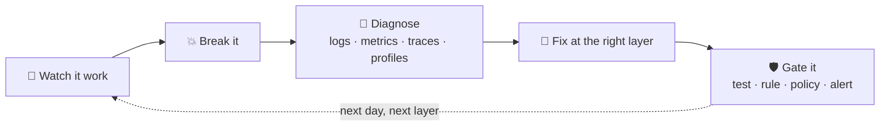
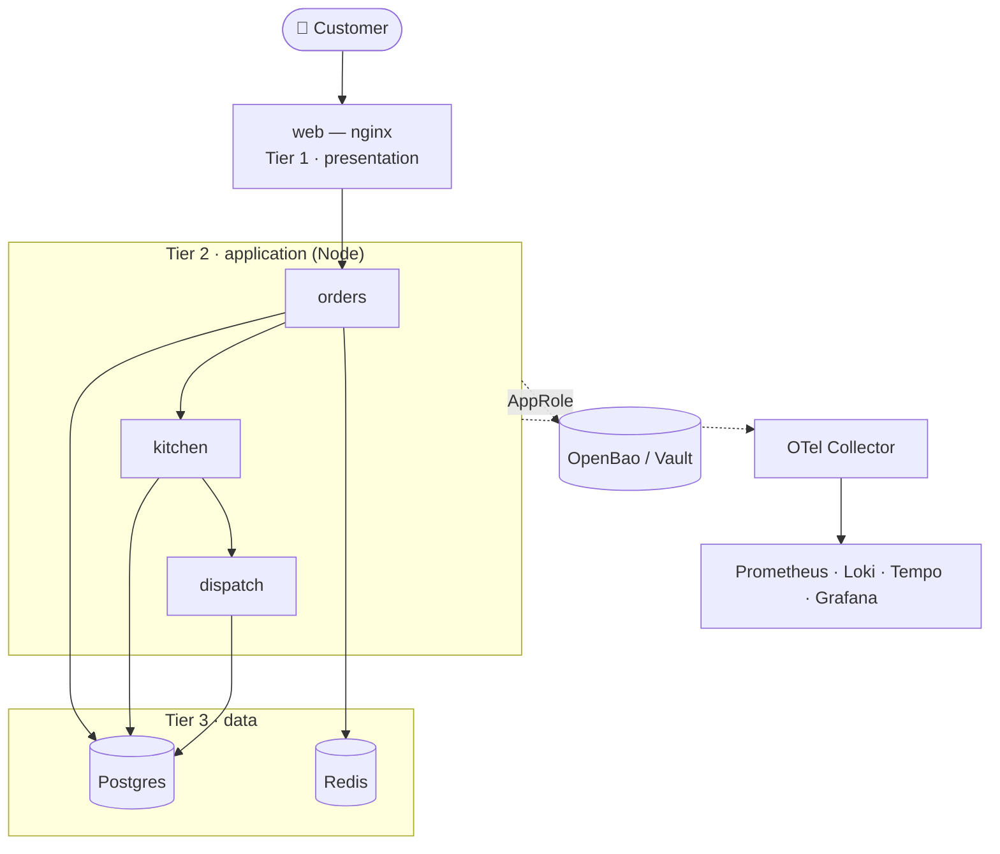
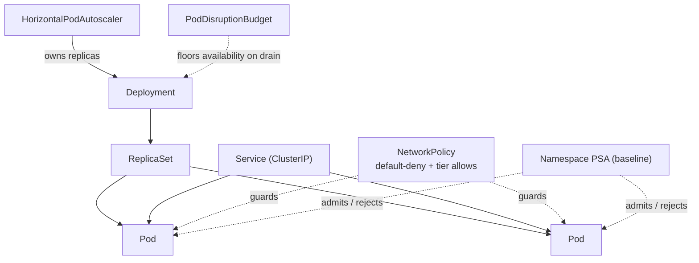
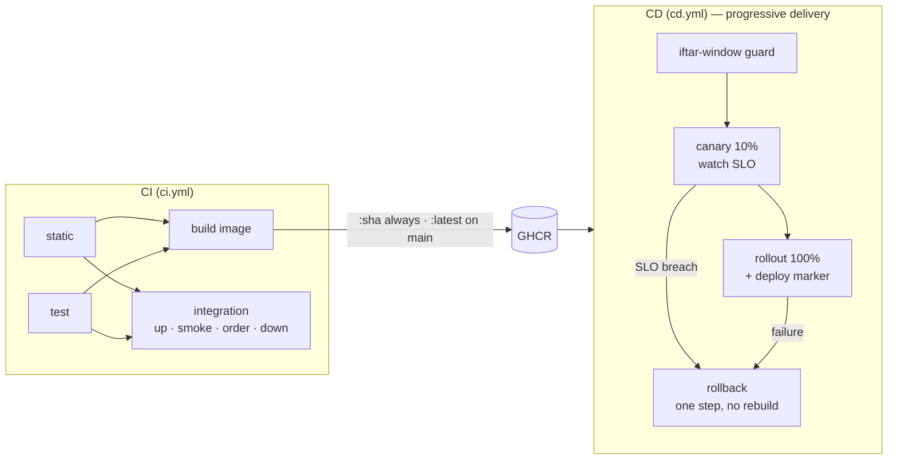
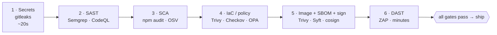
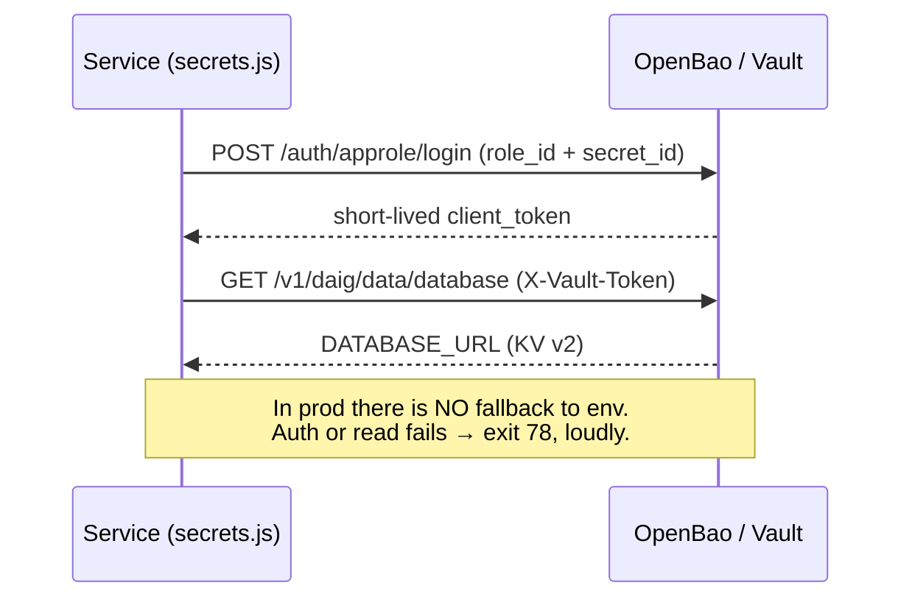
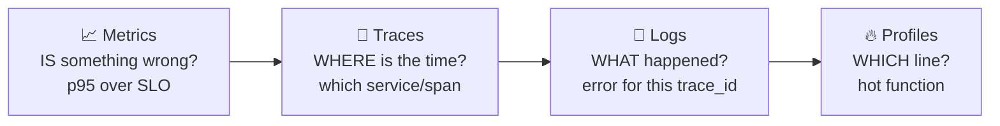

# DevOps & Platform Engineering — Training Handbook

One document, every area the daig rotation touches: **concepts**, **cheatsheets**,
and **guidelines**, each grounded in a real file in this repository. Read it once
end-to-end, then keep it open as a reference while you do
[`ASSIGNMENT.md`](ASSIGNMENT.md).

> This is the *learner-safe* reference — no exercise answers. Worked solutions
> live in [`SOLUTION.md`](SOLUTION.md) (instructor-held). The day-by-day command
> card is [`docs/CHEATSHEET.md`](docs/CHEATSHEET.md).

## How to read this

Each area follows the same shape: **Concept** (what it is and why it matters) →
**In this repo** (where to look) → **Cheatsheet** (the commands/patterns you'll
actually type) → **Guidelines** (the rules that keep you out of trouble).

The golden thread across every area is the **learning loop**:



### The system you're operating

Everything in this handbook is grounded in **daig**, a three-tier food-delivery
platform. Keep this picture in your head:



---

## 🗺️ Pairs with the DevOps Roadmap

[**roadmap.sh/devops**](https://roadmap.sh/devops) is the community-standard map
of *what* to learn. This handbook and [daig](README.md) are the *do it* — most
nodes on that roadmap have a place you can actually break, diagnose, and gate
them here. Where an area has its own dedicated roadmap, it's linked below.

| Area in this handbook | Track it on roadmap.sh |
|---|---|
| §1 Linux & the runtime | [/linux](https://roadmap.sh/linux) |
| §3 Containers · §4 Compose | [/docker](https://roadmap.sh/docker) |
| §5 Kubernetes | [/kubernetes](https://roadmap.sh/kubernetes) |
| §6 IaC — Terraform & Ansible | [/terraform](https://roadmap.sh/terraform) · [/aws](https://roadmap.sh/aws) |
| §7 CI/CD · §10 Observability & SRE | [/devops](https://roadmap.sh/devops) |
| §8 DevSecOps · §9 Secrets | [/devsecops](https://roadmap.sh/devsecops) · [/cyber-security](https://roadmap.sh/cyber-security) |

> **How to use them together:** read a node on the roadmap → find the matching
> section here → do the exercise in [`ASSIGNMENT.md`](ASSIGNMENT.md) → mark the
> node done because you *did* it, not because you watched a video.

---

## Contents

1. [Linux & the runtime](#1-linux--the-runtime)
2. [Git & ways of working](#2-git--ways-of-working)
3. [Containers & Docker](#3-containers--docker)
4. [Docker Compose](#4-docker-compose)
5. [Kubernetes (& Swarm)](#5-kubernetes--swarm)
   - [Traffic management — the five patterns](#traffic-management--the-five-patterns)
6. [Infrastructure as Code — Terraform & Ansible](#6-infrastructure-as-code--terraform--ansible)
7. [CI/CD & progressive delivery](#7-cicd--progressive-delivery)
8. [DevSecOps — the seven gates](#8-devsecops--the-seven-gates)
9. [Secrets — Vault / OpenBao](#9-secrets--vault--openbao)
10. [Observability & SRE](#10-observability--sre)
11. [Chaos engineering](#11-chaos-engineering)
12. [Golden rules (the whole handbook in one screen)](#12-golden-rules)
13. [Command index](#13-command-index)

---

## 1. Linux & the runtime

**Concept.** Everything above runs on a Linux process model: processes have a
PID, receive **signals**, exit with a **code**, and are supervised by something
(systemd, Docker, the kubelet). Two ideas do most of the work in this repo:

- **Signals & graceful shutdown.** A container stop sends `SIGTERM`, then
  `SIGKILL` after a grace period. A well-behaved process traps `SIGTERM`, drains
  in-flight work, and exits. PID 1 in a container does **not** get default signal
  handlers — hence `dumb-init`/`tini` in production images.
- **Exit codes as an API.** daig uses `78` (`EX_CONFIG` from `sysexits.h`)
  everywhere a service is misconfigured — see `services/_shared/guard.js` and
  `secrets.js`. "Exit 78, log names the missing var" is the entire kickoff
  exercise (`make broken`).

**In this repo.** `services/_shared/guard.js` (required-env + exit 78),
`ansible/roles/*` (systemd units, sysctl tuning in `group_vars/all.yml`).

**Cheatsheet.**

| Task | Command |
|---|---|
| Watch processes | `ps aux`, `top`, `htop` |
| Signals | `kill -TERM <pid>` · `kill -9` (SIGKILL, last resort) |
| Service (systemd) | `systemctl status\|start\|stop\|restart <unit>` · `journalctl -u <unit> -f` |
| Ports & sockets | `ss -ltnp` (listening TCP + PIDs) |
| Kernel tunables | `sysctl <key>` · `sysctl -w key=value` |
| Permissions | `chmod`, `chown`, `umask`; octal `0644`/`0755` |
| Exit code of last cmd | `echo $?` |

**Guidelines.**
- Trap `SIGTERM` and drain; never rely on `SIGKILL` for cleanup.
- Make failure **loud and actionable** — exit non-zero with a message a human can
  act on (the missing key, the bad path), not a stack trace.
- Log to **stdout/stderr** as structured JSON; let the platform route it.

---

## 2. Git & ways of working

**Concept.** Trunk-based flow: short-lived `feat/**` / `fix/**` branches, PRs into
a protected `main`, CI as the gate. **Shift left** — the same checks CI runs
should run on your machine in seconds (the pre-commit hook), because feedback that
arrives in 2 seconds changes behaviour and feedback that arrives in 12 minutes
gets worked around.

**In this repo.** `.githooks/pre-commit` (JS/shell/YAML syntax, dummy-value scan,
real-credential refusal, conventional-commit reminder); `.github/` (CODEOWNERS,
PR/issue templates, dependabot).

**Cheatsheet.**

| Task | Command |
|---|---|
| Install the local gate | `make hooks` |
| Branch | `git switch -c feat/thing` |
| Conventional commit | `feat(orders): add idempotency key` |
| See what CI will see | `git diff --cached` before commit |
| Amend last (pre-push) | `git commit --amend` |
| Rebase onto latest main | `git fetch && git rebase origin/main` |

**Guidelines.**
- **Never commit a real secret.** Placeholders are the literal
  `CHANGE_ME_DEV_ONLY`, registered in `DUMMY-VALUES.md`. The hook refuses AWS
  keys, private keys and GitHub tokens outright.
- Conventional commit prefixes: `feat|fix|docs|style|refactor|test|chore|perf|ci|build`.
- Protect `main`: require PR + green CI + a CODEOWNERS review; enable secret
  scanning **with push protection**.

---

## 3. Containers & Docker

**Concept.** An image is an immutable, layered filesystem + metadata; a container
is a running instance. The craft is: **small, reproducible, non-root, observable**.

- **Multi-stage builds** — a fat `deps`/`build` stage, a lean runtime stage that
  copies only artifacts. Smaller image = smaller attack surface + faster pulls.
- **Reproducibility** — build from a **lockfile** (`npm ci`, not `npm install`),
  so the image is a function of committed inputs.
- **Least privilege** — a non-root `USER`, `no-new-privileges`, read-only rootfs
  where possible, and a `HEALTHCHECK` so the platform knows *live vs ready*.

**In this repo.** `services/orders/Dockerfile` (multi-stage, non-root `daig`,
`HEALTHCHECK`, a `broken` target with no `DATABASE_URL` default); every service
has a committed `package-lock.json` and builds with `npm ci`.

**Cheatsheet.**

| Task | Command |
|---|---|
| Build | `docker build -f services/orders/Dockerfile -t daig-orders .` |
| Build a stage | `docker build --target broken -f services/orders/Dockerfile -t x .` |
| Run | `docker run --rm -p 3001:3001 daig-orders` |
| Shell into a running one | `docker exec -it <ctr> sh` |
| Logs | `docker logs -f <ctr>` |
| Inspect layers/size | `docker history ` · `docker image ls` |
| Prune | `docker system prune -af` (careful) |

**Guidelines.**
- Pin base images (`node:22-alpine`); ideally pin by digest for releases.
- `npm ci` in builds; commit lockfiles.
- Run as non-root; drop capabilities; `HEALTHCHECK` on every long-running image.
- Keep a tight `.dockerignore` — never ship `node_modules`, `.git`, `.env`.

---

## 4. Docker Compose

**Concept.** Declarative multi-container topology for one host — dev, CI, and
small deployments. Key mechanics: **health-gated startup** (`depends_on` +
`condition: service_healthy`), **overlays** (a base file plus feature files),
**YAML anchors** for shared config, and **named volumes** for state.

**In this repo.** `docker-compose.yml` (base three tiers + data), plus overlays
`obs`, `security`, `sonar`, `vault`. Note the `x-hardening` anchor
(`no-new-privileges`), per-service resource limits, and `web` waiting on the app
tier's health.

**Cheatsheet.**

| Task | Command |
|---|---|
| Up (base) | `make up` → `docker compose up -d --build` |
| Up with observability | `make obs` |
| Compose overlays | `docker compose -f docker-compose.yml -f docker-compose.obs.yml up -d` |
| Validate without running | `docker compose config -q` |
| Status / logs | `make ps` · `make logs` |
| Exec (psql) | `make psql` |
| Down / wipe volumes | `make down` · `make nuke` |

**Guidelines.**
- Prefer `condition: service_healthy` over bare `depends_on` — start order ≠ ready.
- Put resource `limits` on every service so one runaway can't starve the host.
- Keep secrets out of the file; inject via `.env`/secret store. Dev dummies only.
- One concern per overlay; compose them, don't fork the base.

---

## 5. Kubernetes (& Swarm)

**Concept.** A declarative control loop: you post desired state, controllers
reconcile reality toward it. The four ideas the rotation teaches: **deploy,
scale, self-heal, roll back**. The platform's most valuable behaviour is
**refusing a bad deploy** — a rollout stalls when new pods never become Ready.

Core objects & guardrails (all present in `k8s/base/`):

| Object | Purpose |
|---|---|
| Deployment / StatefulSet | Stateless app tiers / stateful data (postgres, redis + PVC) |
| Service | Stable virtual IP + load-balancing across pods |
| **Probes** | `liveness` (restart if dead — never touches the DB), `readiness` (pull from Service if it can't serve), `startup` (grace for slow boot) |
| **HPA** | Autoscale on CPU; **owns `replicas`** — never set both |
| **PDB** | Floor on availability during voluntary disruptions (drains) |
| **NetworkPolicy** | Default-deny + explicit tier allows (needs a policy-aware CNI) |
| **securityContext / PSA** | Non-root, drop caps, seccomp; namespace-level Pod Security Admission |
| `topologySpreadConstraints` | Spread replicas across nodes so a drain can't breach the PDB |

How the objects relate — who owns what:



**Cheatsheet.**

| Task | Command |
|---|---|
| Render manifests (no cluster) | `kubectl kustomize k8s/base` |
| Apply | `kubectl apply -k k8s/base` |
| Rollout status / history | `kubectl -n daig rollout status deploy/orders` · `... history` |
| **Roll back** | `kubectl -n daig rollout undo deploy/orders` |
| Watch pods / HPA | `kubectl -n daig get pods -w` · `get hpa` |
| Describe (events!) | `kubectl -n daig describe pod <p>` |
| Logs (prev crash) | `kubectl -n daig logs <p> --previous` |
| Exec | `kubectl -n daig exec -it <p> -- sh` |
| Port-forward | `kubectl -n daig port-forward svc/web 8080:80` |

**Swarm** (`swarm/daig-stack.yml`) is the 90-minute on-ramp: same concepts,
simpler surface, `internal: true` data network. `docker stack deploy -c
swarm/daig-stack.yml daig`.

**Guidelines.**
- Pin image tags/digests; `:latest` breaks rollback and can run mixed versions.
- HPA owns `replicas`; declaring both makes the autoscaler thrash.
- Liveness must **not** depend on the database; readiness should.
- Default-deny NetworkPolicy, then allow the flows you need. Confirm your CNI
  actually enforces it.
- `requests` = floor (scheduling), `limits` = ceiling; memory `request == limit`
  for stateful pods avoids early eviction.

---

## Traffic management — the five patterns

**Concept.** Getting a request to the right place — and controlling what leaves —
is its own discipline. Five patterns show up across this repo; know which does
what, and where each one lives.

| Pattern | What it does | Where in this repo |
|---|---|---|
| **Reverse proxy** | Guards **ingress**: one front door, path-routes to backends, terminates/forwards headers & trace context | [`services/web/nginx.conf`](services/web/nginx.conf) — nginx routes `/api/*` to orders/kitchen/dispatch, with `X-Forwarded-*`, timeouts, keepalive upstreams and per-IP `limit_req` |
| **Forward (egress) proxy** | Guards **egress**: outbound calls funnel through an allow-list, everything else refused + logged | [`docker-compose.egress.yml`](docker-compose.egress.yml) + [`security/egress/squid.conf`](security/egress/squid.conf) — `make egress-up` then `make egress-test` (allowed → 200, blocked → 403) |
| **Load balancer** | Spreads traffic across healthy replicas (L4 or L7) | AWS ALB ([`infra/aws/loadbalancer.tf`](infra/aws/loadbalancer.tf), L7, HTTPS + WAF in [`edge.tf`](infra/aws/edge.tf)); k8s `web` ClusterIP behind an **Ingress** ([`k8s/base/ingress.yaml`](k8s/base/ingress.yaml)); Swarm routing mesh ([`swarm/daig-stack.yml`](swarm/daig-stack.yml)); Cloud Run / Container Apps managed LB (with TLS) |
| **Auto scaling** | Adds/removes capacity to match load — reactive, predictive, or request-based | ECS target-tracking **+ scheduled pre-iftar** ([`infra/aws/autoscaling.tf`](infra/aws/autoscaling.tf)); k8s HPA ×4 ([`k8s/base/hpa.yaml`](k8s/base/hpa.yaml)) **+ scheduled CronJobs** ([`k8s/base/scheduled-scale.yaml`](k8s/base/scheduled-scale.yaml)); Cloud Run concurrency; Container Apps KEDA |
| **API gateway** | Edge policy: auth, rate limiting, keys/quotas, WAF, versioning | *Lightweight only* — nginx does routing + `limit_req`; the ALB is the L7 entry. **No managed gateway or WAF yet** — that's the production upgrade (AWS HTTP API / API Gateway, GCP API Gateway, Azure APIM + WAFv2/Cloud Armor) |

**Reverse vs forward — the one-line distinction:** a **reverse** proxy sits in
front of *your servers* and decides what comes **in**; a **forward** proxy sits
in front of *your clients* and decides what goes **out**. daig has one of each.

**Cheatsheet.**

| Task | Command |
|---|---|
| See the reverse proxy route | open `services/web/nginx.conf` · hit `http://localhost:8080/api/orders` |
| Start the forward proxy | `make egress-up` |
| Prove the egress allow-list | `make egress-test` |
| Watch autoscaling (k8s) | `kubectl -n daig get hpa` · drive load with `make load` |
| The ALB (AWS) | `infra/aws/loadbalancer.tf` (note: HTTP-only TODO — add TLS + WAF for real) |

**Guidelines.**
- A reverse proxy fronting backends should always set `X-Forwarded-For` /
  `-Proto` / `Host`, bounded proxy timeouts, and (as a gateway) a rate limit.
- A forward proxy is only as useful as its **allow-list + logs** — the audit
  trail is the point.
- Prefer an **Ingress/API gateway** over one raw L4 LoadBalancer per service
  (TLS, host/path routing, one LB for the cluster).
- Autoscaling: scale **out fast, in slow**; for a *predictable* spike, **pre-scale
  on a schedule** rather than react (see the ECS pre-iftar action).

---

## 6. Infrastructure as Code — Terraform & Ansible

**Concept.** Describe infrastructure as code so it is reviewable, repeatable and
destroyable. Two philosophies:

- **Terraform — declarative & immutable-leaning.** You declare resources; TF
  diffs desired vs the **state file** and makes the minimal change. State must be
  **remote and locked** for teams. Providers move fast — pin versions.
- **Ansible — imperative & convergent.** Ordered tasks that are **idempotent**:
  run twice, second run is all "ok". Great for configuring mutable hosts; loses
  to immutable images the moment drift appears.

**In this repo.** `infra/{aws,gcp,azure}` — deliberately parallel ("concepts
identical, only the nouns change"), with `lifecycle { ignore_changes = [desired_count] }`
on ECS, enforced DB TLS, and VPC flow logs. `ansible/` — four idempotent roles;
the `daig_app` role templates a compose file the systemd unit runs.

**Cheatsheet.**

| Terraform | Ansible |
|---|---|
| `terraform init` (`-backend=false` for CI validate) | `ansible-playbook -i inventories/dev/hosts.yml site.yml` |
| `terraform fmt -check -recursive` | run **twice** → 2nd run all `ok` = idempotent |
| `terraform validate` | `--check` (dry run) · `--diff` |
| `terraform plan` → read before apply | `-l <host>` limit · `-t <tag>` tags |
| `terraform apply` / `destroy` | `ansible-vault encrypt group_vars/secrets.yml` |
| `terraform state list` | handlers run once, at end, only if notified |

**Guidelines.**
- **Remote state + locking** before two people touch the same infra (S3+DynamoDB
  / GCS / azurerm blob lease). Never commit state.
- Pin provider **and** module versions (`versions.tf`).
- Read the **plan** before every apply. `plan` is the review; `apply` is the merge.
- Never fight an autoscaler: `ignore_changes` on counts it manages.
- Secrets come from a vault or cloud secret store, never from `*.tfvars` or
  plaintext `group_vars`; use `no_log: true` on secret tasks.
- `terraform destroy` at the end of every training day — managed Postgres is the
  line item people forget.

---

## 7. CI/CD & progressive delivery

**Concept.** CI proves every change; CD ships it in a way that limits blast
radius. The lesson: a pipeline's most valuable behaviour is **refusing to
deploy**. Progressive delivery (canary → 100%, with automatic rollback) makes
"you can't reach 100% of users without passing 10% first" **structural**.

**In this repo.** `.github/workflows/ci.yml` (static → test matrix → build →
integration), `cd.yml` (iftar-window deploy guard, canary, rollout, rollback),
`security.yml`, `devsecops.yml`, `quality.yml`. All actions **SHA-pinned**; OIDC
(`id-token: write`) instead of long-lived cloud keys.

CI proves the change; CD ships it so it can always be undone:



**Cheatsheet — reading a workflow.**

| Element | What to check |
|---|---|
| `permissions:` | Least privilege; `contents: read` by default, widen per job |
| `uses: owner/repo@<sha>` | Pinned to a **commit SHA**, not a moving tag |
| `concurrency:` | `cancel-in-progress` for CI; **never** cancel a rollout |
| OIDC | `id-token: write` + cloud federation, no stored keys |
| Caching | Keyed on the **lockfile**, not `package.json` |
| Gates | Which jobs **block** vs are advisory (`continue-on-error`) |

**Guidelines.**
- Pin actions to SHAs; let Dependabot bump them.
- Immutable image tags for deploys (`:<sha>`); `:latest` only from the default
  branch, never as a deploy target.
- Rollback must be **one step** and must **not** require a rebuild.
- Annotate every deploy on your dashboards — half of incident triage is "what
  changed, and when".

---

## 8. DevSecOps — the seven gates

**Concept.** Security as **gates in the pipeline**, ordered cheapest-and-fastest
first, so feedback is quick and a developer never waits 12 minutes to learn about
a leaked key. Each gate catches a different class of problem.

**The seven gates** (`.github/workflows/devsecops.yml`, mirrored locally by
`security/scan-all.sh`):

| # | Gate | Tool(s) | Catches |
|---|---|---|---|
| 1 | Secrets | gitleaks | Committed credentials (incl. history) |
| 2 | SAST | Semgrep + CodeQL | Vulnerable code patterns |
| 3 | SCA | `npm audit`, OSV | Vulnerable dependencies |
| 4 | IaC / policy | Trivy config, Checkov, Conftest/OPA | Misconfigured infra, policy violations |
| 5 | Image | Trivy image | CVEs in image layers (**blocks**, `ignore-unfixed`) |
| 5 | Supply chain | SBOM (Syft/CycloneDX) + cosign (keyless) | Provenance & tamper-evidence |
| 6 | DAST | OWASP ZAP baseline | Runtime vulns against the live app |

Ordered cheapest-and-fastest first, so feedback is quick and nobody waits 12
minutes to learn about a typo:



Plus **runtime**: Falco rules, Kyverno/OPA admission policies.

**Cheatsheet.**

| Task | Command |
|---|---|
| Whole toolchain, locally | `make scan` → `./security/scan-all.sh` |
| SAST only (fast) | `make scan-sast` |
| Enable the planted vulns | `make insecure-on` (`chaos/day6-security.sh break`) |
| Detect fixed vs unfixed | `./chaos/day6-security.sh verify` |
| DAST vs running stack | `make dast` |
| Validate Semgrep rules | `semgrep --validate --config security/semgrep/daig.yml` |
| Policy check (OPA) | `conftest test --policy security/policy k8s/base/` |

**Guidelines.**
- Order gates by **cost of feedback**: secrets (20s) first, DAST (minutes) last.
- Fail on **high+** severity, not every low finding — a gate that cries wolf gets
  ignored.
- **Triage, don't just green.** daig has deliberate vulns; making output green
  without understanding it is the anti-lesson.
- Sign images (keyless cosign, OIDC identity) and keep the SBOM — it's the only
  thing that answers "which of our services ships that library" when the next
  Log4Shell lands.

---

## 9. Secrets — Vault / OpenBao

**Concept.** Secrets should be **centralized, access-controlled, audited and
short-lived**. OpenBao (the Linux Foundation Vault fork — same API/CLI) gives:

- **AppRole auth** — splits the credential into a non-secret `role_id` (in config)
  and a short-lived `secret_id` (delivered separately). Compromising one gets you
  nothing.
- **KV v2** — versioned secrets; note the `/data/` path segment (CLI
  `bao kv get daig/database` == API `GET /v1/daig/data/database`).
- **Dynamic secrets** — a per-request PostgreSQL user with a TTL; a leak expires
  itself, and revocation is one lease, not a fleet-wide rotation.
- **Least-privilege policies + `deny`** — a service reads only its own secrets;
  explicit `deny` wins, so it survives a future over-broad grant.

How a service gets its secrets (and why it fails closed):



**In this repo.** `services/_shared/secrets.js` (AppRole → KV → **exit 78**, never
a silent fallback to env in prod), `vault/policies/*.hcl` (per-service, explicit
denies), `vault/config/config.hcl` (annotated dev-vs-prod), `vault/bootstrap.sh`.

**Cheatsheet.**

| Task | Command |
|---|---|
| Init + unseal + provision | `make vault-up` |
| Run app from the vault | `make vault-app` → look for `"credential_source":"openbao"` |
| Guided walkthrough | `make vault-demo` |
| UI + root token | `make vault-ui` |
| Break-glass seal | `make vault-seal` |
| Read a KV secret | `bao kv get daig/database` |

**Guidelines.**
- Never fall back from vault → env **silently** in production — that's how a
  misconfig becomes a six-month leak. Fail closed (exit 78).
- Least privilege per identity; write the `deny` down explicitly.
- TLS on the listener always in prod (`tls_disable = true` is dev-only, annotated).
- Prefer dynamic, short-TTL credentials; renew or reconnect before expiry.

---

## 10. Observability & SRE

**Concept.** You can't operate what you can't see. **Four pillars** — metrics,
logs, traces, profiles — answer different questions, and the value is the
**pivot** between them. On top sit the SRE constructs that turn signals into
decisions: **SLI/SLO/error budgets** and **symptom-based, burn-rate alerting**.

- **RED** (Rate, Errors, Duration) for request-driven services; **USE**
  (Utilization, Saturation, Errors) for resources.
- **SLI** = a measured ratio (e.g. good requests / total). **SLO** = the target
  (99.9% over 30 days = 43 min/month budget). **Error budget** = 1 − SLO.
- **Multi-window burn-rate alerts** page on how fast you're spending budget: fast
  burn (14.4× over 1h **and** 5m) pages; slow burn (6× over 6h & 30m) pages; 3×
  over 24h & 2h opens a ticket. This is the Google SRE workbook pattern.
- **Alert on symptoms the customer feels**, not on causes.
- **Exemplars** link a metric bucket to the exact trace — the p95-spike → trace
  jump.

The pivot chain — four pillars, one request, each answers a different question:



**In this repo.** `observability/` — OTel Collector, Prometheus (31d retention,
remote-write receiver, exemplar storage), Loki/Promtail, Tempo, Pyroscope,
Grafana, **Alertmanager** (severity routing). `rules/slo.yml` — recording rules +
multi-window burn-rate alerts. `services/_shared/{telemetry,metrics}.js`.

**Cheatsheet — PromQL / LogQL.**

| Want | Query |
|---|---|
| Request rate | `sum(rate(daig_http_request_duration_seconds_count[5m]))` |
| Error ratio | `sum(rate(...{status=~"5.."}[5m])) / sum(rate(...[5m]))` |
| p95 latency | `histogram_quantile(0.95, sum by (le)(rate(..._bucket[5m])))` |
| Is it up? | `up{job="daig-services"}` |
| Logs for a trace (LogQL) | `{service="orders"} | json | trace_id="<id>"` |
| Pivot chain | metric spike → exemplar → trace → `tracesToLogs` → `tracesToProfiles` |

**Cheatsheet — access.**

| Task | Command / URL |
|---|---|
| Bring up the stack | `make obs` |
| Grafana | http://localhost:3000 |
| Prometheus | http://localhost:9090 |
| Generate load | `make load` / `make load-spike` |

**Guidelines.**
- Alert on symptoms (availability, latency), route by **severity**
  (critical→page, warning→ticket).
- **Watch cardinality.** Label by service/route/method/status — never by order id,
  user, or area. One high-cardinality label = thousands of series.
- Retention must cover your longest SLO window (31d for a 30-day budget).
- Every dashboard shows *when you deployed* — annotate deploys.
- Instrument at the boundary; propagate trace context across every hop
  (the nginx `traceparent` pass-through is why the traces join up).

---

## 11. Chaos engineering

**Concept.** Deliberately inject failure to find weaknesses **before** they find
you — in a controlled way. The method: state a **steady-state hypothesis**
("p95 < 1s, error rate < 0.1%"), inject **one** fault with a bounded **blast
radius**, observe whether steady state holds, and have a one-command **revert**.

**In this repo.** `chaos/day1-network.sh … day6-security.sh` — each with a clear
symptom, an observable signal, and a `fix`/revert path. They mutate throwaway
`daig-chaos-*` containers, not your primary stack.

**Cheatsheet.**

| Exercise | Break | Revert |
|---|---|---|
| Network partition | `./chaos/day1-network.sh break [variant]` | `… fix` |
| State drift (cloud) | `./chaos/day2-drift.sh <cloud>` | (reconcile) |
| Crashloop | `./chaos/day3-crashloop.sh break [variant]` | `… fix` |
| Latency injection | `./chaos/day4-latency.sh break` | `… fix` |
| Demo-day gauntlet | `./chaos/day5-demoday.sh <action> <N>` | `… fix <N>` |
| Security (planted vulns) | `./chaos/day6-security.sh break` · `verify` | `… fix` |

**Guidelines.**
- One variable at a time — you're testing a hypothesis, not making a mess.
- Bound the blast radius; know the revert **before** you break anything.
- Map each fault to the signal that should catch it. If nothing lights up, your
  observability has a gap — that's a finding too.

---

## 12. Golden rules

The whole handbook, compressed:

1. **Fail loud, fail closed.** Exit non-zero with an actionable message; never
   degrade silently (env fallback, ignored error).
2. **Reproducible or it didn't happen.** Lockfiles, pinned images, pinned
   actions, pinned providers.
3. **Immutable artifacts.** `:latest` is not a version. Deploy a digest; roll back
   to a digest.
4. **Least privilege everywhere.** Non-root containers, scoped IAM/AppRole, minimal
   CI `permissions:`, default-deny networking.
5. **Health ≠ readiness ≠ liveness.** Model the three separately or you'll turn a
   slow dependency into an outage.
6. **One owner per field.** HPA owns replicas; an autoscaler owns `desired_count`.
   Never declare both.
7. **Alert on symptoms, page on burn rate.** Route by severity; watch cardinality.
8. **Gate what you fix.** Every bug you close gets a test, a rule, or a policy so
   it can't come back.
9. **Read the plan / the diff before you apply / merge.**
10. **Secrets live in a vault, never in Git.** Dummies are the literal
    `CHANGE_ME_DEV_ONLY`, and even those never reach production.

---

## 13. Command index

```bash
# core
make up            # start the three tiers
make seed          # load restaurants + menu
make smoke         # verify every tier answers
make psql          # shell on the database
make down / nuke   # stop (keep / delete volumes)

# observability
make obs           # stack + Grafana (:3000)
make load          # iftar spike   ·   make load-spike  (peak only)

# reliability (k8s)
kubectl apply -k k8s/base
kubectl -n daig get pods -w   ·   get hpa
kubectl -n daig rollout undo deploy/orders

# IaC
terraform -chdir=infra/aws init -backend=false && … validate
ansible-playbook -i ansible/inventories/dev/hosts.yml ansible/site.yml   # run twice

# security
make scan          # full toolchain   ·   make scan-sast (fast)
make insecure-on   # enable planted vulns   ·   ./chaos/day6-security.sh verify
make dast          # ZAP baseline

# secrets
make vault-up      # init + unseal + provision
make vault-app     # run app from OpenBao (expect credential_source: openbao)

# checks
make check         # static: js + shell + yaml + json, no Docker needed
make test          # unit tests
make hooks         # install the pre-commit gate
make broken        # the kickoff exit-78 image
```

> Full day-by-day command card: [`docs/CHEATSHEET.md`](docs/CHEATSHEET.md).
> Now go do [`ASSIGNMENT.md`](ASSIGNMENT.md).
