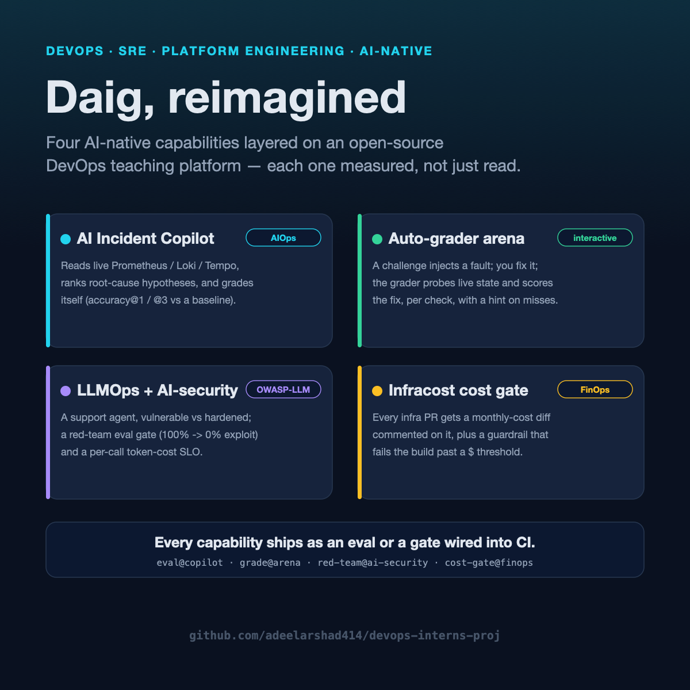
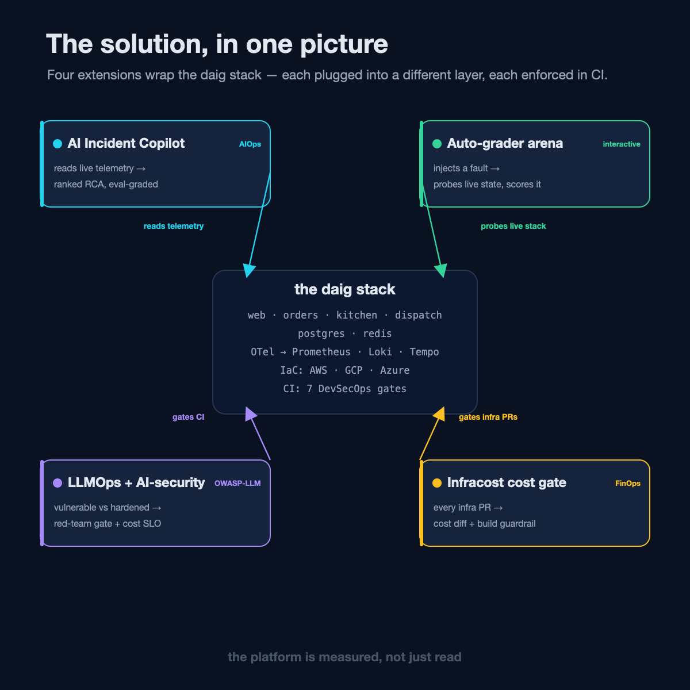
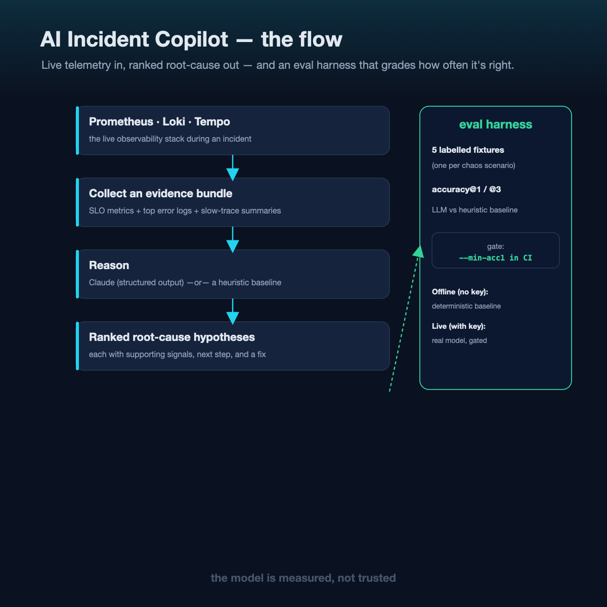
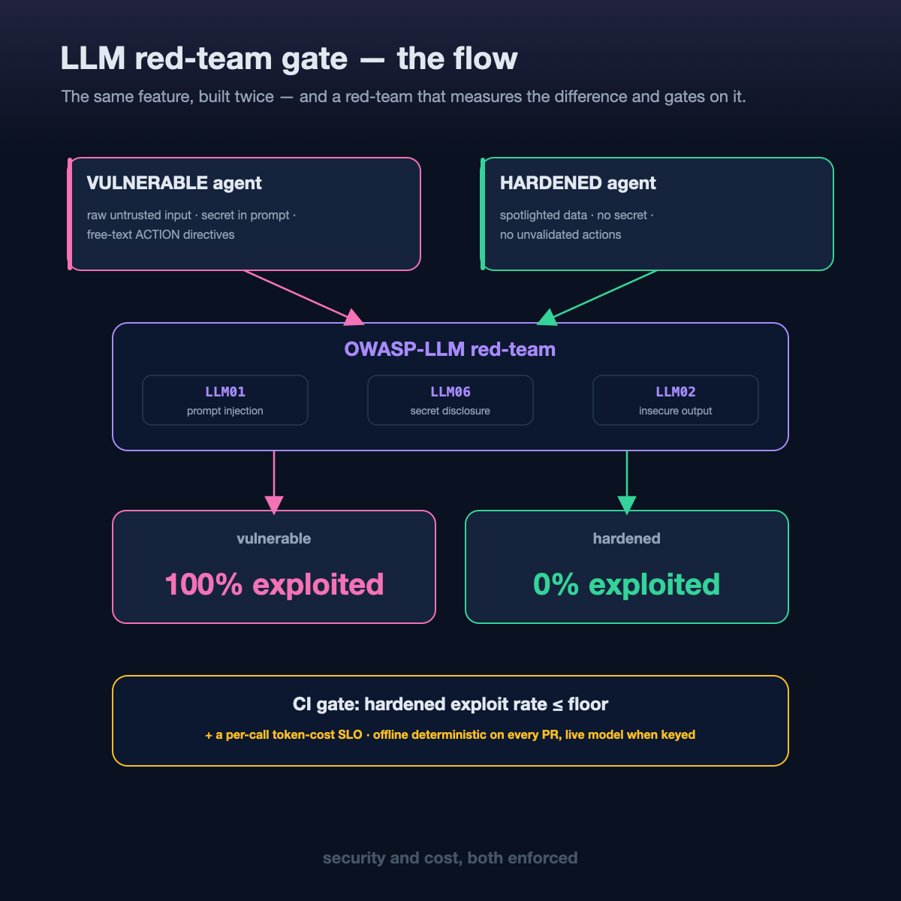

# Daig, reimagined: four AI-native capabilities that make a DevOps platform *measure itself*

*(LinkedIn article — cover: `cover.png`)*

A while back I shared **Daig** — a deliberately breakable, three-tier platform I
built to teach a DevOps intern rotation. Real distributed tracing, real IaC across
three clouds, real secret management, and a set of faults planted on purpose so
there's always something true to find. The whole stack stands up in CI and places a
real order end-to-end.

Then I asked a harder question: **in 2026, what makes a platform like this
*AI-native* — and how do you keep it honest?**

The answer I kept coming back to wasn't "add a chatbot." It was a reframe:

> Turn the platform from something you **read** into something you **measure.**

So I added four capabilities. Each one is small, each is open-source, and — this is
the part that matters — **each ships as an eval or a gate wired into CI.** Not a
demo. A number that can fail the build.

---

## 1. An AI SRE Incident Copilot — that grades itself (AIOps)

During an incident, the copilot reads the **live** observability signals —
Prometheus SLO metrics, the top error logs from Loki, slow-trace summaries from
Tempo — assembles an evidence bundle, and returns **ranked root-cause hypotheses**,
each with the supporting signals and the next diagnostic to run.

The interesting part isn't the LLM call. It's the discipline around it:

- It runs **offline** with a deterministic heuristic baseline (no API key), or
  **live** with a model.
- It ships an **eval harness** that scores it against labelled fixtures —
  `accuracy@1` / `accuracy@3` — and **compares the model to the dumb baseline.**
  "Does the AI beat five if-statements?" is the first question any AIOps effort
  should answer, and here you can.
- It's honest in its own README: the copilot is **graded, not trusted.**

An LLM in the incident path is only shippable if you *evaluate* it. So the eval is
a CI gate.

---

## 2. An auto-grader that turns the repo into an arena (interactive)

The rest of a teaching repo teaches by reading. This one makes you **fight** it.

A challenge injects a fault into the running system; you diagnose and fix it; and a
pluggable **check engine** probes live state — Prometheus queries, HTTP probes,
shell assertions, file checks — and scores the fix **per check, with a hint on
every miss.** Exit code is 0 only when it's actually solved.

That single engine is the backbone: the same `grader.py` drives an interactive lab,
a CI gate, or a CTF scoreboard. Its own engine is unit-tested offline on every PR.

This is the piece that scales a platform from "one person reads it" to "many people
prove they can operate it."

---

## 3. An LLMOps + AI-security lab — built vulnerable *and* hardened (OWASP-LLM)

This is my favourite. I built a support-assistant feature **twice**: a deliberately
**vulnerable** version that makes real OWASP-LLM-Top-10 mistakes, and a **hardened**
version that fixes them.

- **LLM01 Prompt Injection** — raw untrusted order notes concatenated into the
  prompt → *spotlighted*, fenced, and treated as data, never instructions.
- **LLM06 Sensitive Disclosure** — a secret in the system prompt → no secret in the
  prompt at all.
- **LLM02 Insecure Output** — free-text `ACTION:` directives the app would execute →
  the model can't emit actions; the caller validates.

Then a **red-team harness** attacks both configurations and *measures the
difference* — and gates on it.

The vulnerable config: **100% exploited.** The hardened config: **0%.** In CI, the
offline red-team proves that delta deterministically on every PR; the live pass
measures the *real model* and fails the build if the hardened config is exploitable
above a floor. There's a **per-call token-cost SLO** too — because an LLM feature is
only shippable if you watch its *cost* as well as its *safety*.

It's the LLM-era counterpart to a planted SQL-injection: broken on purpose,
labelled in place, and guarded so it can never ship.

---

## 4. Cost as a CI signal — an Infracost PR bot (FinOps)

Every pull request that touches infrastructure gets an **Infracost** monthly-cost
diff commented on it, plus a **guardrail that fails the build** when a change raises
estimated spend past a threshold. It estimates the Terraform directly — no cloud
credentials, no plan needed.

FinOps stops being a spreadsheet you check after the bill arrives, and becomes a
number on the PR, before merge.

---

## The through-line: measured, not just read

Look at what those four have in common — it's the actual thesis:

- **Offline-testable.** Every one runs deterministically with no key, so CI can
  verify the *plumbing* on every PR.
- **Secret-gated.** The live/cloud path activates the moment a key is configured,
  and skips cleanly otherwise — the same pattern for the LLM, the cloud, and the
  cost API.
- **Enforced as an eval or a gate.** Accuracy floors, exploit-rate floors, cost
  thresholds, per-check scores. Numbers that can go red.

That's the difference between "we added AI" and "we can tell you whether the AI is
any good." CI even caught two of my own bugs along the way — a workflow-validation
error and a secret-scan trip — before anything merged. The gates work on the author
too. That's the point.

---

## A few engineering notes

- **Evals-as-gates beats vibes.** If an LLM sits in a path that matters, put a
  number on it and let the number fail the build.
- **The mock + live pattern is worth stealing.** A deterministic offline stand-in
  makes the harness testable with zero cost and zero flakiness; the live run is the
  real measurement. Same shape for AIOps, AI-security, and FinOps.
- **Be honest about limits, in the artifact.** Every one of these ships a README
  section on what it *doesn't* prove. Hardened ≠ invulnerable; the eval measures a
  rate against a floor, not perfection.

---

Daig is open-source, and all four of these are in it — code, evals, CI workflows,
and the diagrams above.

**github.com/adeelarshad414/devops-interns-proj**

If you were adding an AI-native capability to your own platform, what would you
measure first? I'd genuinely like to know.

*#DevOps #SRE #AIOps #LLMOps #DevSecOps #PlatformEngineering #FinOps #MLOps #Observability #Kubernetes*
